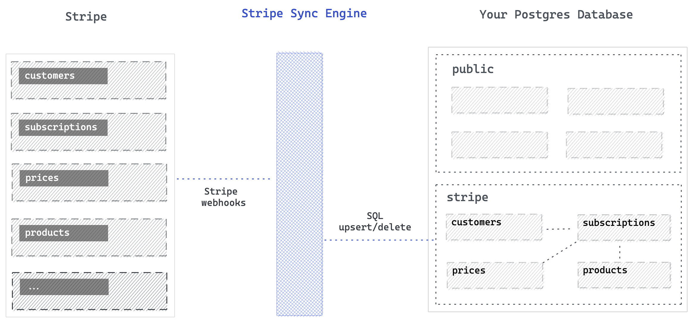

# Stripe Sync Engine Monorepo


This monorepo contains packages for synchronizing your Stripe account with a PostgreSQL database:

- [`@supabase/stripe-sync-engine`](./packages/sync-engine/README.md): A TypeScript library with `StripeAutoSync` for easy integration into Express apps, plus lower-level APIs for custom implementations.
- [`stripe-sync-cli`](./packages/cli/README.md): A CLI tool for development and testing with automatic ngrok tunnel setup.
- [`stripe-sync-fastify`](./packages/fastify-app/README.md): A Fastify-based server and Docker image for production deployments.


---

## Motivation

Sometimes you want to analyze your billing data using SQL. Even more importantly, you want to join your billing data to your product/business data.

This project synchronizes your Stripe account to a PostgreSQL database. It can be a new database, or an existing PostgreSQL database.

---

## StripeAutoSync

The easiest way to integrate Stripe sync into your Express application:

```typescript
import { StripeAutoSync } from 'stripe-experiment-sync'

// baseUrl is a function for dynamic URL generation
// (e.g., for ngrok tunnels, Replit domains, or environment-based URLs)
const getPublicUrl = () => {
  if (process.env.PUBLIC_URL) {
    return process.env.PUBLIC_URL
  }
  // Or dynamically determine from request, ngrok, etc.
  return `https://${process.env.REPLIT_DOMAINS?.split(',')[0]}`
}

const stripeAutoSync = new StripeAutoSync({
  databaseUrl: process.env.DATABASE_URL,
  stripeApiKey: process.env.STRIPE_SECRET_KEY,
  baseUrl: getPublicUrl,
})

await stripeAutoSync.start(app) // Express app
// ... later
await stripeAutoSync.stop() // Cleanup
```

### Configuration Options

| Option             | Required | Default            | Description                           |
| ------------------ | -------- | ------------------ | ------------------------------------- |
| `databaseUrl`      | Yes      | -                  | PostgreSQL connection string          |
| `stripeApiKey`     | Yes      | -                  | Stripe secret key (sk\_...)           |
| `baseUrl`          | Yes      | -                  | Function returning your public URL    |
| `webhookPath`      | No       | `/stripe-webhooks` | Path where webhook handler is mounted |
| `stripeApiVersion` | No       | `2020-08-27`       | Stripe API version                    |

---

## How it works



- Automatically runs database migrations to create the `stripe` schema with tables matching Stripe objects.
- Creates managed webhooks in Stripe for automatic event synchronization.
- Exposes a webhook endpoint that listens to Stripe events.
- Automatically applies body parsing middleware (protecting webhook routes from JSON parsing).
- Inserts, updates, or deletes records in the database whenever there is a change to Stripe.
- Cleans up webhooks automatically on shutdown.

---

## Packages

- [Library: @supabase/stripe-sync-engine](./packages/sync-engine/README.md)
- [CLI: stripe-sync](./packages/cli/README.md)
- [Docker/Server: supabase/stripe-sync-engine](./packages/fastify-app/README.md)

Each package has its own README with installation, configuration, and usage instructions.

---

## Supabase Edge Function

To deploy the sync-engine to a Supabase Edge Function, follow this [guide](./docs/edge-function.md).

## Webhook Support

- [ ] `balance.available`
- [x] `charge.captured` 🟢
- [x] `charge.expired` 🟢
- [x] `charge.failed` 🟢
- [x] `charge.pending` 🟢
- [x] `charge.refunded` 🟢
- [x] `charge.refund.updated` 🟡 - For updates on all refunds, listen to `refund.updated` instead
- [x] `charge.succeeded` 🟢
- [x] `charge.updated` 🟢
- [x] `charge.dispute.closed` 🟢
- [x] `charge.dispute.created` 🟢
- [x] `charge.dispute.funds_reinstated` 🟢
- [x] `charge.dispute.funds_withdrawn` 🟢
- [x] `charge.dispute.updated` 🟢
- [x] `checkout.session.async_payment_failed` 🟢
- [x] `checkout.session.async_payment_succeeded` 🟢
- [x] `checkout.session.completed` 🟢
- [x] `credit_note.created` 🟢
- [x] `credit_note.updated` 🟢
- [x] `credit_note.voided` 🟢
- [x] `customer.created` 🟢
- [x] `customer.deleted` 🟢
- [ ] `customer.source.created`
- [ ] `customer.source.updated`
- [x] `customer.subscription.created` 🟢
- [x] `customer.subscription.deleted` 🟢
- [x] `customer.subscription.paused` 🟢
- [x] `customer.subscription.pending_update_applied` 🟢
- [x] `customer.subscription.pending_update_expired` 🟢
- [x] `customer.subscription.resumed` 🟢
- [x] `customer.subscription.trial_will_end` 🟢
- [x] `customer.subscription.updated` 🟢
- [x] `customer.tax_id.created` 🟢
- [x] `customer.tax_id.deleted` 🟢
- [x] `customer.tax_id.updated` 🟢
- [x] `customer.updated` 🟢
- [x] `invoice.created` 🟢
- [x] `invoice.deleted` 🟢
- [x] `invoice.finalized` 🟢
- [x] `invoice.finalization_failed` 🟢
- [x] `invoice.marked_uncollectible` 🟢
- [x] `invoice.paid` 🟢
- [x] `invoice.payment_action_required` 🟢
- [x] `invoice.payment_failed` 🟢
- [x] `invoice.payment_succeeded` 🟢
- [x] `invoice.sent` 🟢
- [ ] `invoice.upcoming` 🔴 - Event has no id and cannot be processed
- [x] `invoice.updated` 🟢
- [x] `invoice.overdue` 🟢
- [x] `invoice.overpaid` 🟢
- [x] `invoice.will_be_due` 🟢
- [x] `invoice.voided` 🟢
- [ ] `issuing_authorization.request`
- [ ] `issuing_card.created`
- [ ] `issuing_cardholder.created`
- [x] `payment_intent.amount_capturable_updated` 🟢
- [x] `payment_intent.canceled` 🟢
- [x] `payment_intent.created` 🟢
- [x] `payment_intent.partially_refunded` 🟢
- [x] `payment_intent.payment_failed` 🟢
- [x] `payment_intent.processing` 🟢
- [x] `payment_intent.requires_action` 🟢
- [x] `payment_intent.succeeded` 🟢
- [x] `payment_method.attached` 🟢
- [x] `payment_method.automatically_updated` 🟢
- [x] `payment_method.detached` 🟢
- [x] `payment_method.updated` 🟢
- [x] `plan.created` 🟢
- [x] `plan.deleted` 🟢
- [x] `plan.updated` 🟢
- [x] `price.created` 🟢
- [x] `price.deleted` 🟢
- [x] `price.updated` 🟢
- [x] `product.created` 🟢
- [x] `product.deleted` 🟢
- [x] `product.updated` 🟢
- [x] `radar.early_fraud_warning.created` 🟢
- [x] `radar.early_fraud_warning.updated` 🟢
- [x] `refund.created` 🟢
- [x] `refund.failed` 🟢
- [x] `refund.updated` 🟢
- [x] `review.opened` 🟢
- [x] `review.closed` 🟢
- [x] `setup_intent.canceled` 🟢
- [x] `setup_intent.created` 🟢
- [x] `setup_intent.requires_action` 🟢
- [x] `setup_intent.setup_failed` 🟢
- [x] `setup_intent.succeeded` 🟢
- [x] `subscription_schedule.aborted` 🟢
- [x] `subscription_schedule.canceled` 🟢
- [x] `subscription_schedule.completed` 🟢
- [x] `subscription_schedule.created` 🟢
- [x] `subscription_schedule.expiring` 🟢
- [x] `subscription_schedule.released` 🟢
- [x] `subscription_schedule.updated` 🟢
- [x] `entitlements.active_entitlement_summary.updated` 🟢
