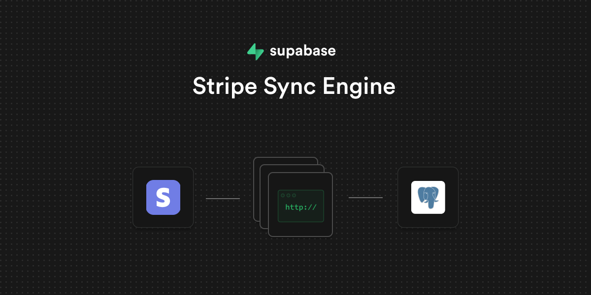

# Stripe Sync Engine Monorepo


This monorepo contains packages for synchronizing your Stripe account with a PostgreSQL database:

- [`stripe-experiment-sync`](./packages/sync-engine/README.md): A TypeScript library for syncing Stripe data to PostgreSQL with managed webhooks, CLI tools, and Supabase Edge Function deployment.
- [`stripe-sync-fastify`](./packages/fastify-app/README.md): A Fastify-based server and Docker image for production deployments.



---

## Motivation

Sometimes you want to analyze your billing data using SQL. Even more importantly, you want to join your billing data to your product/business data.

This project synchronizes your Stripe account to a PostgreSQL database. It can be a new database, or an existing PostgreSQL database.

---

## Quick Start

The easiest way to sync Stripe data to PostgreSQL:

```typescript
import { StripeSync } from 'stripe-experiment-sync'

const sync = new StripeSync({
  poolConfig: {
    connectionString: process.env.DATABASE_URL,
    max: 10,
  },
  stripeSecretKey: process.env.STRIPE_SECRET_KEY,
})

// Create a managed webhook - automatically syncs all Stripe events
const webhook = await sync.webhook.findOrCreateManagedWebhook('https://example.com/stripe-webhooks')

// Cleanup when done
await sync.close()
```

### Manual Webhook Processing

If you need to process webhooks in your own Express/Node.js app:

```typescript
import express from 'express'
import { StripeSync } from 'stripe-experiment-sync'

const app = express()
const sync = new StripeSync({
  poolConfig: {
    connectionString: process.env.DATABASE_URL,
    max: 10,
  },
  stripeSecretKey: process.env.STRIPE_SECRET_KEY,
})

app.post('/stripe-webhooks', express.raw({ type: 'application/json' }), async (req, res) => {
  const signature = req.headers['stripe-signature']

  try {
    await sync.webhook.processWebhook(req.body, signature)
    res.status(200).send({ received: true })
  } catch (error) {
    res.status(400).send({ error: error.message })
  }
})

app.listen(3000)
```

### Supabase Edge Functions

Deploy to Supabase for serverless operation:

```bash
npx stripe-experiment-sync supabase install \
  --token $SUPABASE_ACCESS_TOKEN \
  --project $SUPABASE_PROJECT_REF \
  --stripe-key $STRIPE_API_KEY
```

### CLI Commands

```bash
# Run database migrations
npx stripe-experiment-sync migrate --database-url $DATABASE_URL

# Start local sync with ngrok tunnel
npx stripe-experiment-sync start \
  --stripe-key $STRIPE_API_KEY \
  --ngrok-token $NGROK_AUTH_TOKEN \
  --database-url $DATABASE_URL

# Backfill historical data
npx stripe-experiment-sync backfill customer \
  --stripe-key $STRIPE_API_KEY \
  --database-url $DATABASE_URL
```

---

## Configuration Options

| Option                          | Type    | Description                                                                                              |
| ------------------------------- | ------- | -------------------------------------------------------------------------------------------------------- |
| `poolConfig`                    | object  | **Required.** PostgreSQL connection pool configuration. Supports `connectionString`, `max`, `keepAlive`. |
| `stripeSecretKey`               | string  | **Required.** Stripe secret key (sk\_...)                                                                |
| `stripeWebhookSecret`           | string  | Stripe webhook signing secret (only needed for manual webhook processing)                                |
| `stripeApiVersion`              | string  | Stripe API version (default: `2020-08-27`)                                                               |
| `enableSigma`                   | boolean | Enable Stripe Sigma reporting data sync. Default: false                                                  |
| `autoExpandLists`               | boolean | Fetch all list items from Stripe (not just the default 10)                                               |
| `backfillRelatedEntities`       | boolean | Ensure related entities exist for foreign key integrity                                                  |
| `revalidateObjectsViaStripeApi` | Array   | Always fetch latest data from Stripe instead of trusting webhook payload                                 |
| `logger`                        | Logger  | Logger instance (pino-compatible)                                                                        |

---

## How it works


- Automatically runs database migrations to create the `stripe` schema with tables matching Stripe objects.
- Creates managed webhooks in Stripe for automatic event synchronization.
- Processes webhook events and syncs data to PostgreSQL in real-time.
- Supports backfilling historical data from Stripe.
- Tracks sync runs and provides observability into sync operations.
- Built-in retry logic for rate limits and transient errors.

---

## Packages

- [Library & CLI: stripe-experiment-sync](./packages/sync-engine/README.md)
- [Docker/Server: stripe-sync-fastify](./packages/fastify-app/README.md)

Each package has its own README with installation, configuration, and usage instructions.

---

## Supabase Edge Function Deployment

Deploy the sync engine to Supabase Edge Functions for serverless operation with automatic webhook processing. See the [sync-engine README](./packages/sync-engine/README.md#supabase-deployment) for detailed instructions.

```bash
npx stripe-experiment-sync supabase install \
  --token $SUPABASE_ACCESS_TOKEN \
  --project $SUPABASE_PROJECT_REF \
  --stripe-key $STRIPE_API_KEY
```

---

## Webhook Support

- [ ] `balance.available`
- [x] `charge.captured` 🟢
- [x] `charge.expired` 🟢
- [x] `charge.failed` 🟢
- [x] `charge.pending` 🟢
- [x] `charge.refunded` 🟢
- [x] `charge.refund.updated` 🟡 - For updates on all refunds, listen to `refund.updated` instead
- [x] `charge.succeeded` 🟢
- [x] `charge.updated` 🟢
- [x] `charge.dispute.closed` 🟢
- [x] `charge.dispute.created` 🟢
- [x] `charge.dispute.funds_reinstated` 🟢
- [x] `charge.dispute.funds_withdrawn` 🟢
- [x] `charge.dispute.updated` 🟢
- [x] `checkout.session.async_payment_failed` 🟢
- [x] `checkout.session.async_payment_succeeded` 🟢
- [x] `checkout.session.completed` 🟢
- [x] `credit_note.created` 🟢
- [x] `credit_note.updated` 🟢
- [x] `credit_note.voided` 🟢
- [x] `customer.created` 🟢
- [x] `customer.deleted` 🟢
- [ ] `customer.source.created`
- [ ] `customer.source.updated`
- [x] `customer.subscription.created` 🟢
- [x] `customer.subscription.deleted` 🟢
- [x] `customer.subscription.paused` 🟢
- [x] `customer.subscription.pending_update_applied` 🟢
- [x] `customer.subscription.pending_update_expired` 🟢
- [x] `customer.subscription.resumed` 🟢
- [x] `customer.subscription.trial_will_end` 🟢
- [x] `customer.subscription.updated` 🟢
- [x] `customer.tax_id.created` 🟢
- [x] `customer.tax_id.deleted` 🟢
- [x] `customer.tax_id.updated` 🟢
- [x] `customer.updated` 🟢
- [x] `invoice.created` 🟢
- [x] `invoice.deleted` 🟢
- [x] `invoice.finalized` 🟢
- [x] `invoice.finalization_failed` 🟢
- [x] `invoice.marked_uncollectible` 🟢
- [x] `invoice.paid` 🟢
- [x] `invoice.payment_action_required` 🟢
- [x] `invoice.payment_failed` 🟢
- [x] `invoice.payment_succeeded` 🟢
- [x] `invoice.sent` 🟢
- [x] `invoice.upcoming` — Acknowledged and skipped (preview object with no `id`)
- [x] `invoice.updated` 🟢
- [x] `invoice.overdue` 🟢
- [x] `invoice.overpaid` 🟢
- [x] `invoice.will_be_due` 🟢
- [x] `invoice.voided` 🟢
- [ ] `issuing_authorization.request`
- [ ] `issuing_card.created`
- [ ] `issuing_cardholder.created`
- [x] `payment_intent.amount_capturable_updated` 🟢
- [x] `payment_intent.canceled` 🟢
- [x] `payment_intent.created` 🟢
- [x] `payment_intent.partially_refunded` 🟢
- [x] `payment_intent.payment_failed` 🟢
- [x] `payment_intent.processing` 🟢
- [x] `payment_intent.requires_action` 🟢
- [x] `payment_intent.succeeded` 🟢
- [x] `payment_method.attached` 🟢
- [x] `payment_method.automatically_updated` 🟢
- [x] `payment_method.detached` 🟢
- [x] `payment_method.updated` 🟢
- [x] `plan.created` 🟢
- [x] `plan.deleted` 🟢
- [x] `plan.updated` 🟢
- [x] `price.created` 🟢
- [x] `price.deleted` 🟢
- [x] `price.updated` 🟢
- [x] `product.created` 🟢
- [x] `product.deleted` 🟢
- [x] `product.updated` 🟢
- [x] `radar.early_fraud_warning.created` 🟢
- [x] `radar.early_fraud_warning.updated` 🟢
- [x] `refund.created` 🟢
- [x] `refund.failed` 🟢
- [x] `refund.updated` 🟢
- [x] `review.opened` 🟢
- [x] `review.closed` 🟢
- [x] `setup_intent.canceled` 🟢
- [x] `setup_intent.created` 🟢
- [x] `setup_intent.requires_action` 🟢
- [x] `setup_intent.setup_failed` 🟢
- [x] `setup_intent.succeeded` 🟢
- [x] `subscription_schedule.aborted` 🟢
- [x] `subscription_schedule.canceled` 🟢
- [x] `subscription_schedule.completed` 🟢
- [x] `subscription_schedule.created` 🟢
- [x] `subscription_schedule.expiring` 🟢
- [x] `subscription_schedule.released` 🟢
- [x] `subscription_schedule.updated` 🟢
- [x] `entitlements.active_entitlement_summary.updated` 🟢

---

## Contributing

Issues and pull requests are welcome at [https://github.com/stripe-experiments/sync-engine](https://github.com/stripe-experiments/sync-engine).

## License

See [LICENSE](LICENSE) file.
