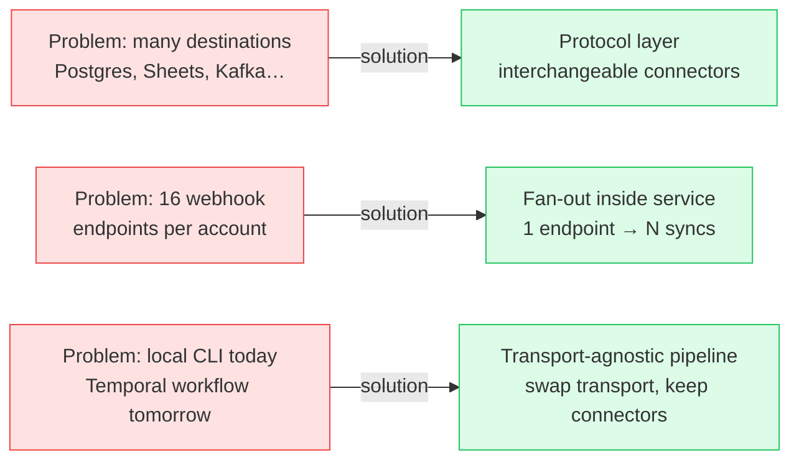
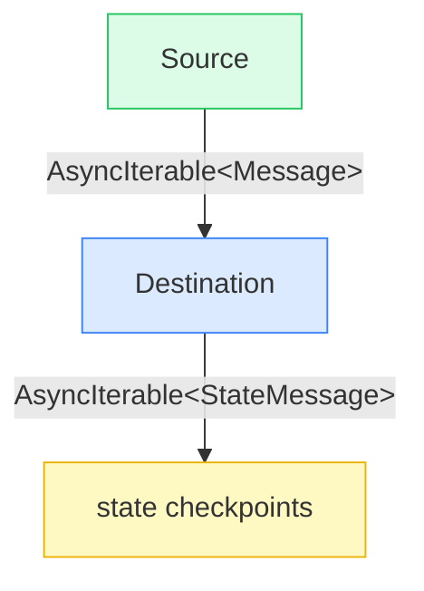
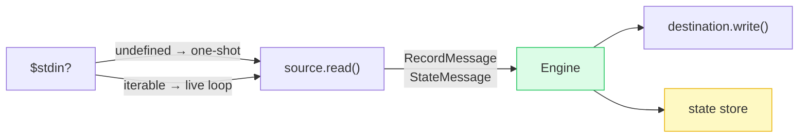
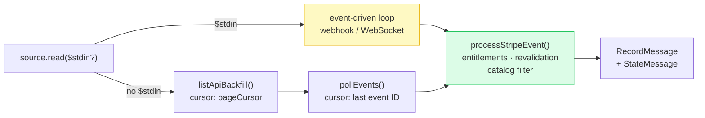
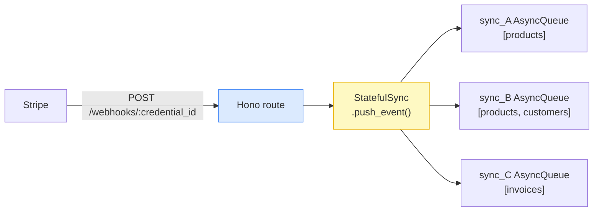
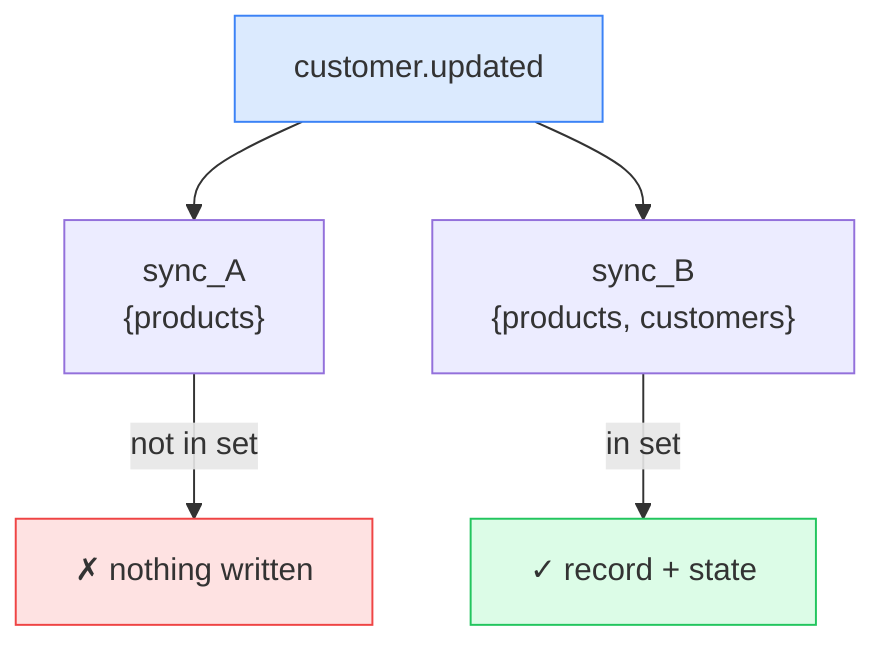
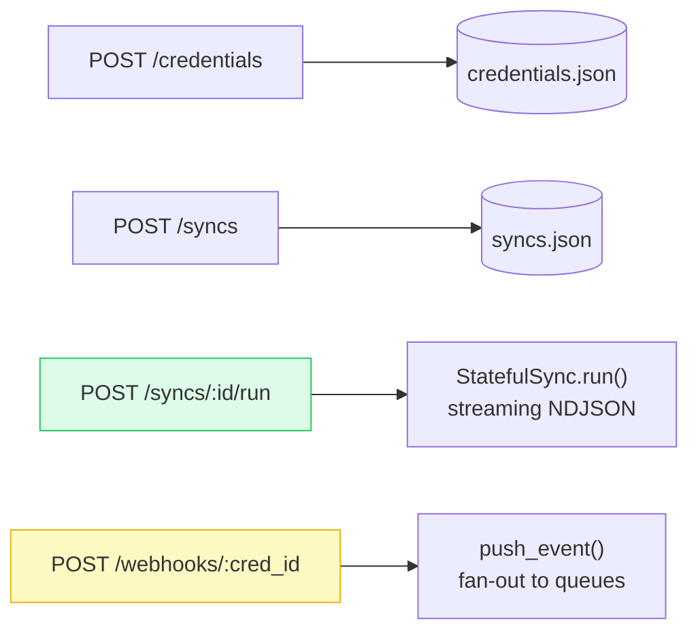
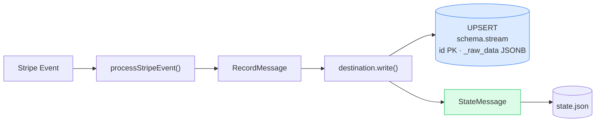

# Sync Engine Architecture

A transport-agnostic pipeline for syncing Stripe data to any destination

---

## Why This Architecture?

<Transform :scale="0.85">



</Transform>

---

## Three-Layer Stack

```
┌─────────────────────────────────────────────────┐
│  packages/stateful-sync  (service)              │
│  StatefulSync · stores · fan-out queues         │  ← adds persistence
├─────────────────────────────────────────────────┤
│  packages/stateless-sync  (engine)              │
│  createEngine() · connector loader              │  ← wires the pipeline
│  NDJSON streaming · CLI helpers                 │
├─────────────────────────────────────────────────┤
│  packages/protocol                              │
│  Source<TConfig, TState, TInput>                │  ← what connectors implement
│  Destination<TConfig, TState>                   │
└─────────────────────────────────────────────────┘
```

Each layer only knows about the layer below it.
Connectors only know about `protocol` — nothing about persistence or transport.

---

## layout: two-cols

## The Protocol Contract

```ts
interface Source<TConfig, TState, TInput = never> {
  spec():    ConnectorSpecification
  check():   Promise<CheckResult>
  discover(): Promise<ConfiguredCatalog>
  setup():   Promise<void>
  read(params, $stdin?): AsyncIterable<Message>
  teardown({ remove_shared_resources? }): Promise<void>
}

interface Destination<TConfig, TState> {
  spec():   ConnectorSpecification
  setup():  Promise<void>
  write(messages): AsyncIterable<StateMessage>
}
```

`Message` = `RecordMessage | StateMessage | ErrorMessage`

::right::

<br/><br/>



State flows **as messages** — connectors never touch a DB directly.

---

## layout: two-cols

## Message Protocol

The pipeline speaks **NDJSON** — one message per line.

```ts
// Source → Engine: full union
type Message =
  | RecordMessage // a record to write
  | StateMessage // cursor checkpoint
  | CatalogMessage // stream discovery
  | LogMessage // diagnostic output
  | ErrorMessage // structured failure
  | StreamStatusMessage // progress update

// Engine → Destination: filtered down
type DestinationInput = RecordMessage | StateMessage // engine strips the rest
```

The engine is the filter. Destinations never see logs,
errors, or status messages — only data and checkpoints.

::right::

```ts
type RecordMessage = {
  type: 'record'
  stream: string // target table / stream
  data: Record<string, unknown>
  emitted_at: number // epoch ms
}

type StateMessage = {
  type: 'state'
  stream: string // which stream's cursor
  data: unknown // opaque — only source reads this
}

type ErrorMessage = {
  type: 'error'
  failure_type: 'config_error' | 'system_error' | 'transient_error' | 'auth_error'
  message: string
  stream?: string
  stack_trace?: string
}
```

---

## The Pipeline

<Transform :scale="0.82">



</Transform>

| `$stdin`             | Behaviour                         |
| -------------------- | --------------------------------- |
| `undefined`          | backfill → events poll → done     |
| `AsyncIterable<...>` | skips backfill, live loop forever |

The **same interface** works locally (direct pipe) or in cloud (Temporal activities).

---

## Source-Stripe: Three Sync Modes

<Transform :scale="0.8">



</Transform>

All verified `Stripe.Event` objects converge through `processStripeEvent()`.

---

## Webhook Fan-out

Stripe caps accounts at **~16 webhook endpoints**. One endpoint for all syncs.

<Transform :scale="0.82">



</Transform>

Each sync has its own `AsyncQueue` under `credential_id`.
`run()` registers on start, deregisters on stop — no leaked queues.

---

## layout: two-cols

## Stream Filtering

Filtering happens **inside the source**, not at ingress.

```ts {4}
// source-stripe/src/process-event.ts

const resourceConfig = registry[normalizeStripeObjectName(dataObject.object)]

if (!streamNames.has(resourceConfig.tableName)) return
//  ↑ the filter
```

`streamNames` built at `read()` startup:

```ts
const streamNames = new Set(catalog.streams.map((s) => s.stream.name))
```

::right::

<br/>



---

## Stateful API

<Transform :scale="0.82">



</Transform>

Schemas are built **dynamically at startup** from registered connectors.
Credential and sync schemas become discriminated unions over registered connector types.

---

## Destination: Postgres

<Transform :scale="0.82">



</Transform>

- Schema per sync — complete isolation between syncs
- `_raw_data` stores the full Stripe object; typed columns via generated columns
- Tables created on first write — no migration step required

---

## Key Design Decisions

**`$stdin` as the seam**
`undefined` → one-shot backfill. Infinite async iterable → live event loop.
Same `Source` interface handles both. No protocol changes needed for webhooks.

**Stateless / Stateful split**
`cli` + `api` = one-shot, caller provides everything, no memory between calls.
`service` = persistent cursors, credential store, lifecycle management.

**`remove_shared_resources` on teardown**
Service checks whether other syncs share the credential before deleting
the webhook endpoint — prevents one sync from breaking its siblings.

**Connector isolation**
Connectors implement `protocol` only. They have no knowledge of stores,
queues, HTTP routes, or cloud infrastructure. Swap the transport; keep the connector.
