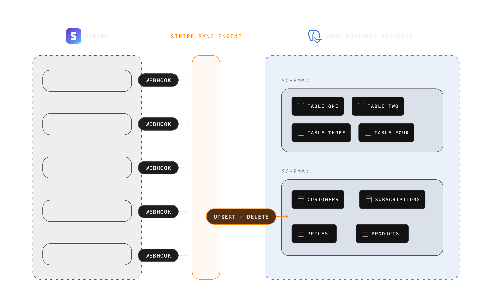

# Stripe Sync Engine

Sync Stripe data into PostgreSQL for analytics, reporting, and operational workflows.

This project keeps your Stripe resources in sync with a `stripe` schema in Postgres and supports both one-off backfills and continuous sync.

---

## How It Works

- Creates and migrates the `stripe` schema in your Postgres database
- Processes Stripe events through webhook or websocket listeners
- Upserts Stripe objects into Postgres tables designed for queryability
- Tracks sync progress with resumable status metadata

---

## Documentation

- [TypeScript usage](./typescript.md)
- [Docker deployment](./docker.md)
- [Supabase Edge Functions](./edge-function.md)
- [Postgres schema reference](./postgres-schema.md)
- [Webhook event support matrix](./webhook-event-support.md)
- [Contributing](./contributing.md)
