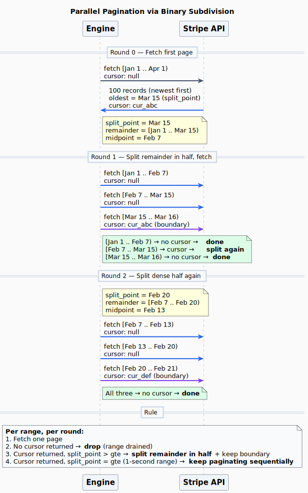

# Parallel Pagination via Binary Subdivision

## The Problem

### Setup

| Symbol          | Meaning                                                     | Example         |
| --------------- | ----------------------------------------------------------- | --------------- |
| `total_records` | Total records in the time range (unknown upfront)           | 1,000,000       |
| `page_size`     | Max records the API returns per request                     | 100             |
| `min_pages`     | Minimum requests needed = `ceil(total_records / page_size)` | 10,000          |
| `time_span`     | `T_end - T_start` in seconds                                | 7,776,000 (90d) |

### The goal

You must fetch all `total_records` records from `[T_start, T_end)`. The API
returns at most `page_size` per request. You need at least **`min_pages`**
requests — unavoidable.

The question isn't total requests. It's **rounds** — how many sequential batches
of parallel requests?

| Strategy              | Total requests | Rounds       |
| --------------------- | -------------- | ------------ |
| Sequential pagination | `min_pages`    | `min_pages`  |
| Perfect partitioning  | `min_pages`    | **1**        |
| This algorithm        | ≤ 2× `min_pages` | **O(log M)** |

Perfect partitioning requires knowing the time boundaries `[t_i, t_i+1)` where
each bucket holds exactly `page_size` records. That requires knowing the
distribution in advance.

### The question

> For an **unknown** distribution of `total_records` across `[T_start, T_end)`,
> what is the minimum number of **rounds** to discover bucket boundaries and
> fetch all records?

### Constraints

1. **No histogram.** The API won't tell you how many records exist in a time
   range without fetching them.
2. **Opaque cursors.** You can't seek to an arbitrary offset. You can only start
   a fresh time-range query or continue an existing cursor.
3. **Unknown density.** The ratio of records to time varies arbitrarily.

The only signal is **fetching a page and seeing that more data remains** (a
cursor is returned).

---

## The Algorithm

One rule:

> **If a range returned a cursor, split its unfetched remainder in half.**

That's it. Binary subdivision. No density estimation, no tuning parameters.

### Round 0: Fetch

Fetch one page from `[T_start, T_end)`. The API returns the newest `page_size`
records. If there's more data, a cursor is returned and the oldest record's
timestamp is the `split_point`.

```
[T_start ───────────────────────────────── T_end)
                                ▲
                           split_point

[───── older (unfetched) ──────][── fetched ──]
```

### Round 1: Split in half

Split `[T_start, split_point)` at its midpoint. Fetch both halves in parallel.
Continue the cursor at the boundary.

```
[──── left half ────][──── right half ────][boundary]
  cursor: null         cursor: null         cursor: kept

────────── all fetched in parallel ──────────→
```

### Round 2+: Repeat

Any half that returned a cursor → split its remainder in half again.
Any half that completed → done, drop it.

```
Round 2:  [done] [split→ ][done]
                  ↓    ↓
Round 3:        [done] [split→ ]
                        ↓    ↓
Round 4:              [done] [done]
```

Dense halves keep splitting. Sparse halves complete and disappear.

---

## Complexity

### Shorthand

```
R = total_records
P = page_size
M = ceil(R / P)            (minimum pages needed)
S = distinct seconds that contain records
```

### Rounds

Each round, every range with a cursor splits into 2. Starting from 1 range:

```
Round 0:  1 range
Round 1:  up to 2 ranges
Round 2:  up to 4 ranges
Round 3:  up to 8 ranges
...
Round r:  up to 2^r ranges
```

Done when every range fits in one page. That happens when `2^r ≥ M`:

```
rounds = ceil(log₂(M)) + 1
```

| `total_records` | `M` (pages) | Rounds |
| --------------- | ----------- | ------ |
| 200             | 2           | 2      |
| 1,600           | 16          | 5      |
| 10,000          | 100         | 8      |
| 100,000         | 1,000       | 11     |
| 1,000,000       | 10,000      | 15     |
| 100,000,000     | 1,000,000   | 21     |

A million records in 15 rounds. A hundred million in 21.

### Total requests

Every record is fetched exactly once (`M` useful requests). The overhead is
segments that land on empty time ranges — they cost one request to discover
they're empty.

In the worst case (maximally skewed data), every split produces one empty half
and one full half. That's at most 1 wasted request per split, and there are at
most `M` splits total:

```
total requests ≤ 2M
```

**Binary subdivision never more than doubles your API calls.** Compare this to
higher fan-outs (N=16) where skewed data can waste 15 requests per split.

### Best case: Uniform distribution

Records are evenly spread. Every split produces two halves of roughly equal
density. After each round, each half is 2x smaller.

```
Round 0:   1 range,   M pages of data
Round 1:   2 ranges,  each ~M/2 pages
Round 2:   4 ranges,  each ~M/4 pages
...
Round r:   2^r ranges, each ~1 page → done
```

**Rounds: `ceil(log₂(M)) + 1`.** Total requests: ~M (almost no waste — both
halves hit data).

### Worst case: Single-timestamp concentration

All `R` records at the same timestamp `t`.

```
Round 0:  Fetch 1 page. split_point = t.
          Split [T_start, t) in half — both halves empty.
          Boundary [t, t+1) has all remaining records.

Round 1:  2 empty halves complete (wasted).
          Boundary fetches 1 more page. Can't split a 1-second range.

Round M:  Done.
```

**Rounds: M.** Degrades to sequential. The time dimension collapsed to a single
point — there's nothing to split. No algorithm can do better when the API's only
partitioning axis is time and all records share one second.

### What determines complexity

The algorithm subdivides **time**. Its power depends on temporal spread:

```
S ≥ M:   enough seconds for one page each → O(log₂ M) rounds
S = 1:   all records in one second         → O(M) rounds

General: O(log₂ M) + (serial drain of the densest single second)
```

A single second with `D` records adds `ceil(D/P)` serial rounds. Everything
else parallelizes. For Stripe data, `D` per second is typically small (a few
hundred at most), so the `log₂ M` term dominates.

### Edge cases

| Scenario                    | Distribution      | Rounds       | Total requests |
| --------------------------- | ----------------- | ------------ | -------------- |
| Empty range                 | —                 | 1            | 1              |
| Single page                 | any               | 1            | 1              |
| Two pages, one second       | all at `t`        | 2            | 2              |
| Uniform, M=16               | even              | 5            | ~16            |
| Uniform, M=10,000           | even              | 15           | ~10,000        |
| 99% in 1hr of 1yr           | skewed            | ~15          | ~10,000        |
| 100% in one second          | degenerate        | M            | M + 1          |

### Summary

| Distribution            | Rounds              | Total requests |
| ----------------------- | ------------------- | -------------- |
| **Uniform**             | `ceil(log₂ M) + 1`  | ~M             |
| **Clustered**           | `ceil(log₂ M) + 1`  | ≤ 2M           |
| **Single second**       | M                    | M + 1          |
| **Typical Stripe data** | **10–15**            | ~M             |

### Why binary and not N-ary?

The algorithm was originally N-ary (split into N pieces, with N up to 16).
Binary is better for this use case:

1. **Waste is bounded at 2x.** Each split wastes at most 1 request (the empty
   half). N=16 wastes up to 15 per split on skewed data.
2. **Rounds are still logarithmic.** `log₂` vs `log₁₆` is a ~4x constant
   factor. For typical M=1,000–100,000, that's 11–17 rounds vs 3–5.
3. **Rate limits matter.** Stripe APIs are rate-limited. Burning empty requests
   on skewed streams exhausts quota. Binary is the most conservative strategy.
4. **No tuning.** N=2 is fixed. No fan-out parameter, no density heuristic,
   no budget allocation across ranges.

---

## Diagram

([source](binary-search.puml))



---

## Pure Functions

All functions are **pure** — data in, data out, no I/O:

| Function             | Input                            | Output    |
| -------------------- | -------------------------------- | --------- |
| `nextStep()`         | `SearchState`, `maxSegments`     | `Range[]` |
| `subdivideRanges()`  | `Range[]`, max, `lastObserved`   | `Range[]` |
| `toUnixSeconds()`    | ISO string                       | number    |
| `toIso()`            | unix seconds                     | ISO string|

The caller (engine) handles all I/O: fetching pages, recording `lastObserved`,
and feeding results back into the next `nextStep()` call.
