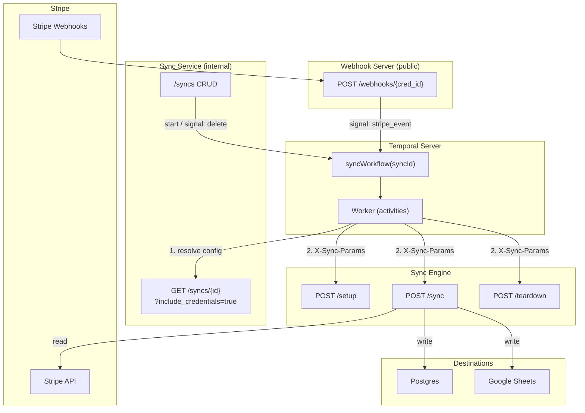
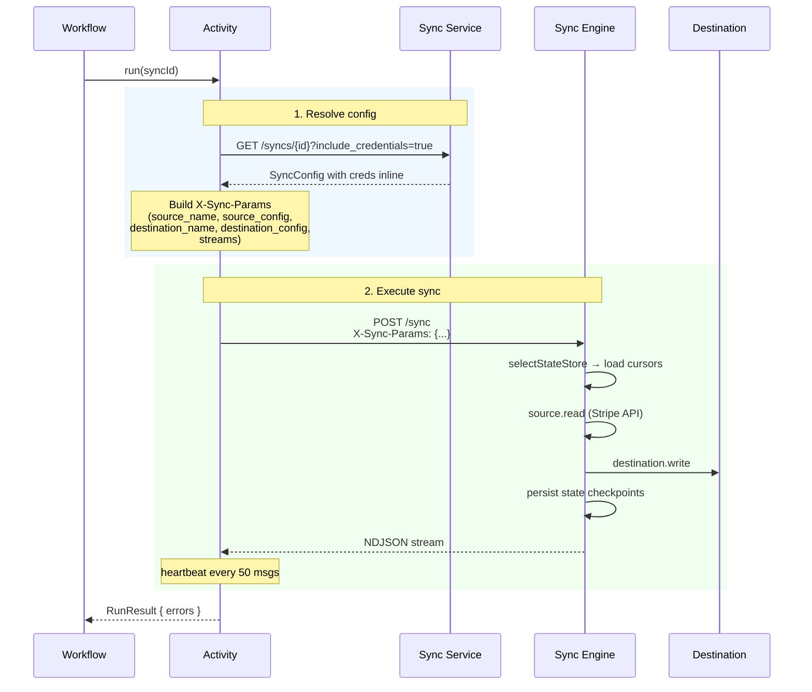
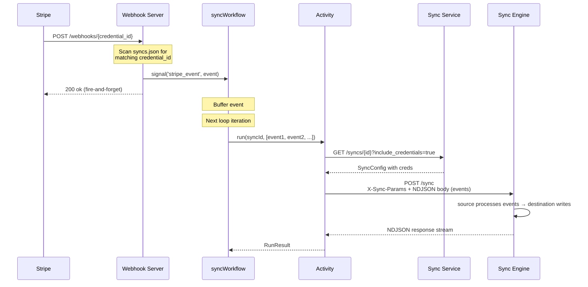
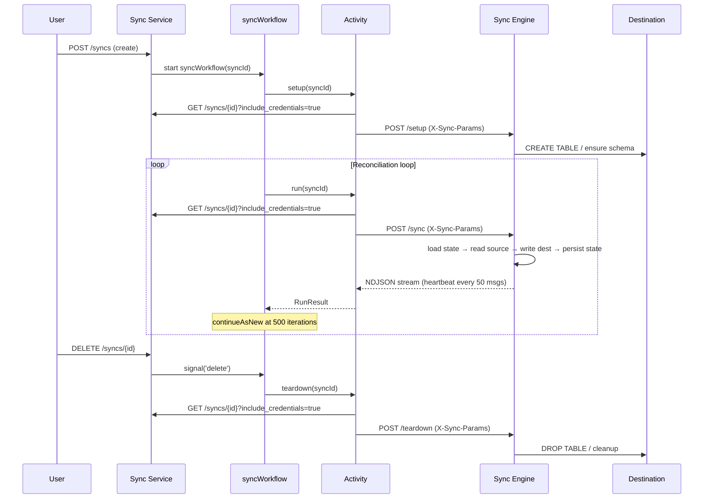
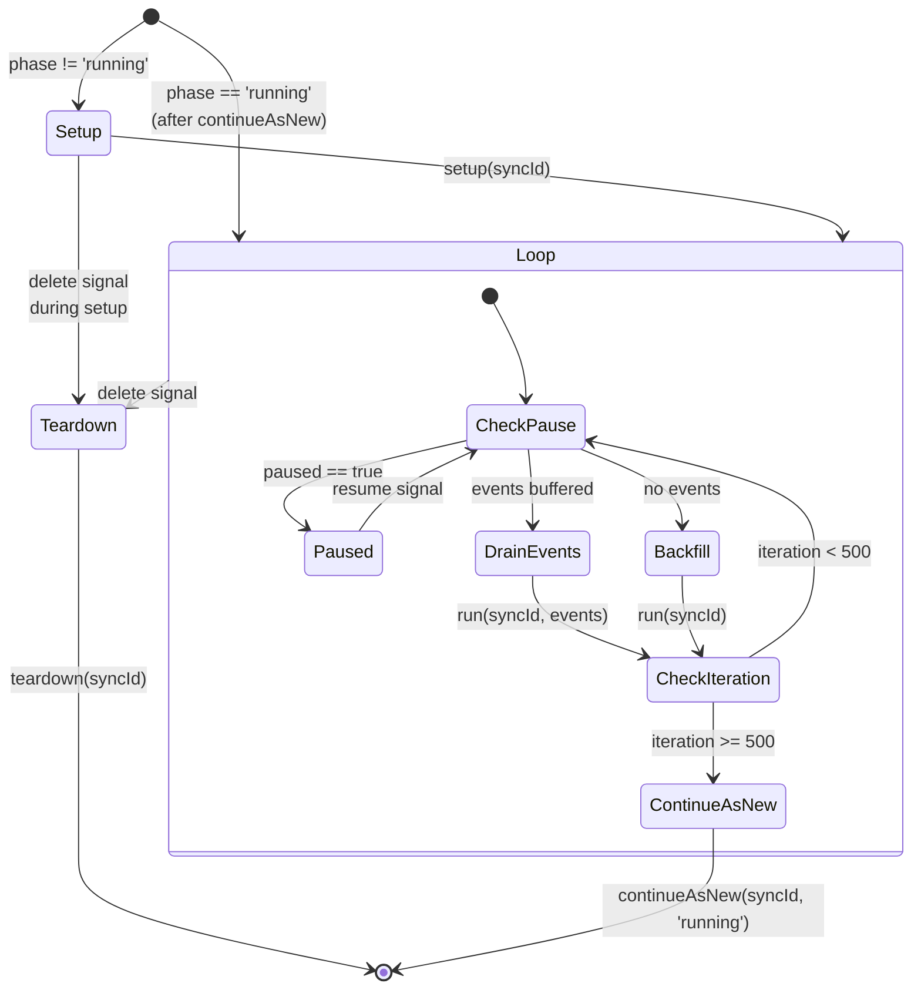

# Temporal Workflow Architecture

When Temporal is enabled, sync lifecycle is managed by durable workflows instead of running in-process. The workflow orchestrates setup, continuous reconciliation, live event processing, and teardown.

Three servers run independently:

- **Webhook Server** — public-facing; receives raw Stripe events and signals the matching Temporal workflow(s)
- **Service API** — internal; config CRUD, credential management, config resolution
- **Engine API** — stateless sync execution (setup, sync, teardown via `X-Sync-Params`)

Activities call the service for config resolution, then the engine for execution.

## Architecture Overview



## Activity Flow

Each activity makes two HTTP calls — one lightweight (resolve), one heavy (execute):



## Webhook Event Flow

The webhook path crosses four boundaries (Stripe → Webhook Server → Temporal → Service → Engine):



## Backfill Flow



## Workflow State Machine



## Key Design Decisions

### Why three servers?

Each server has a single, clearly scoped responsibility:

|             | Webhook Server                                      | Sync Service                                        | Sync Engine                                 |
| ----------- | --------------------------------------------------- | --------------------------------------------------- | ------------------------------------------- |
| **Purpose** | Public webhook ingress; fan out signals to Temporal | Config CRUD, credential management, config resolution | Stateless sync execution                    |
| **State**   | None — reads config store to locate matching syncs  | Stores configs, credentials                         | Manages cursor state via `selectStateStore` |
| **Routes**  | `POST /webhooks/{credential_id}`                    | `/syncs`, `/credentials`                            | `/setup`, `/sync`, `/teardown`              |
| **Exposure**| Public (Stripe POSTs here)                          | Internal                                            | Internal                                    |

The webhook server requires only a Temporal client and the config store (read-only) to fan out signals. It never touches credentials or runs connectors.

### Why activities resolve each time?

Activities call `GET /syncs/{id}?include_credentials=true` on every invocation rather than carrying config in the workflow. This means:

- Workflow stays `syncId`-only — lightweight `continueAsNew`
- Config changes via `PATCH /syncs/{id}` are picked up automatically
- No `updateConfigSignal` needed
- Credential refresh (if any) is always fresh
- The resolution call is milliseconds; the sync call is seconds to minutes

### State management

The engine handles state internally via `selectStateStore`:

1. Engine auto-detects a compatible state store package (`@stripe/sync-state-postgres` for postgres destinations)
2. `setupStateStore()` creates the `_sync_state` table if needed
3. Engine loads cursors on each run, persists checkpoints during sync
4. Activities and workflows never touch state

## Components

### Workflow (`temporal/workflows.ts`)

**Input:** `syncWorkflow(syncId: string, opts?: { phase?: string })`

**Signals:** `stripe_event`, `pause`, `resume`, `delete`

**Query:** `status` → `{ phase, paused, iteration }`

### Activities (`temporal/activities.ts`)

`createActivities({ serviceUrl, engineUrl })` returns three activities:

- **`setup(syncId)`** — resolve from service → `POST /setup` on engine
- **`run(syncId, input?)`** — resolve from service → `POST /sync` on engine (with optional NDJSON body for events)
- **`teardown(syncId)`** — resolve from service → `POST /teardown` on engine

### Worker (`temporal/worker.ts`)

Runs as a separate process via the CLI:

```sh
sync-service worker \
  --temporal-address localhost:7233 \
  --service-url http://localhost:4020 \
  --engine-url http://localhost:4010
```

## Running Locally

```sh
# Terminal 1: Temporal dev server
temporal server start-dev

# Terminal 2: Sync engine (stateless execution)
sync-engine serve --port 4010

# Terminal 3: Sync service (config CRUD + config resolution)
sync-service serve --port 4020 --temporal-address localhost:7233

# Terminal 4: Webhook server (public ingress)
sync-service webhook --port 4030 --temporal-address localhost:7233

# Terminal 5: Worker
sync-service worker --temporal-address localhost:7233
```

Create a sync — the workflow starts automatically:

```sh
# Create sync (via internal service API)
curl -X POST http://localhost:4020/syncs \
  -H 'Content-Type: application/json' \
  -d '{
    "source": { "type": "stripe", "api_key": "sk_test_..." },
    "destination": { "type": "postgres", "connection_string": "postgresql://..." },
    "streams": [{ "name": "products" }]
  }'

# Check workflow status
temporal workflow query --workflow-id sync_<id> --type status

# Pause/resume
curl -X POST http://localhost:4020/syncs/<id>/pause
curl -X POST http://localhost:4020/syncs/<id>/resume

# Delete (triggers teardown)
curl -X DELETE http://localhost:4020/syncs/<id>
```

Point Stripe's webhook dashboard at the **webhook server** (`http://your-host:4030/webhooks/{credential_id}`), not the service API.

## Testing

### Unit tests (stubbed activities)

`apps/service/src/__tests__/temporal-workflow.test.ts` — uses `@temporalio/testing` with stubbed activities:

- Setup → reconciliation → delete lifecycle
- Event processing via `stripe_event` signal
- Pause/resume
- Teardown on delete
- `continueAsNew` phase skip

### E2E tests (real Stripe + real destinations)

`e2e/temporal.test.ts` — starts both service + engine servers, uses `@temporalio/testing` with real Stripe API:

**Stripe → Postgres** (requires `STRIPE_API_KEY`):

1. Creates sync via service API
2. Backfills products from Stripe into Postgres
3. Updates a product via Stripe API, signals the event to the workflow
4. Verifies the live update landed in Postgres
5. Signals delete, verifies teardown (schema dropped)

**Stripe → Google Sheets** (requires `STRIPE_API_KEY` + Google OAuth creds):

1. Creates sync via service API
2. Backfills products into a Google Sheet tab
3. Verifies row count and data shape
4. Cleans up the test tab

## Files

| File                                                   | Role                                            |
| ------------------------------------------------------ | ----------------------------------------------- |
| `apps/service/src/api/webhook-app.ts`                  | `createWebhookApp` — standalone webhook ingress |
| `apps/service/src/temporal/types.ts`                   | `RunResult`, `SyncActivities`, `WorkflowStatus` |
| `apps/service/src/temporal/activities.ts`              | Resolve from service, execute on engine         |
| `apps/service/src/temporal/workflows.ts`               | Workflow: signals, queries, main loop           |
| `apps/service/src/temporal/worker.ts`                  | Worker factory                                  |
| `apps/service/src/cli/main.ts`                         | `serve`, `webhook`, `worker` subcommands        |
| `apps/service/src/__tests__/temporal-workflow.test.ts` | Unit tests                                      |
| `e2e/temporal.test.ts`                                 | E2E tests                                       |
