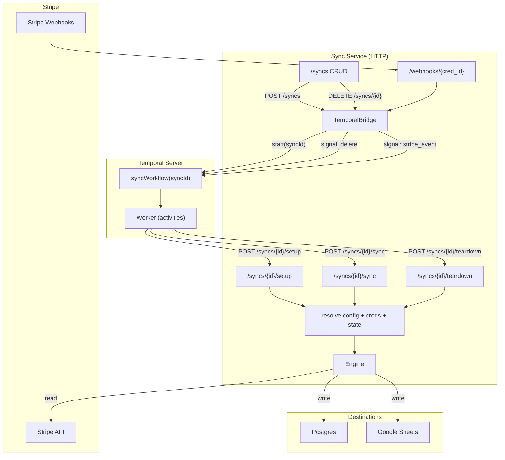
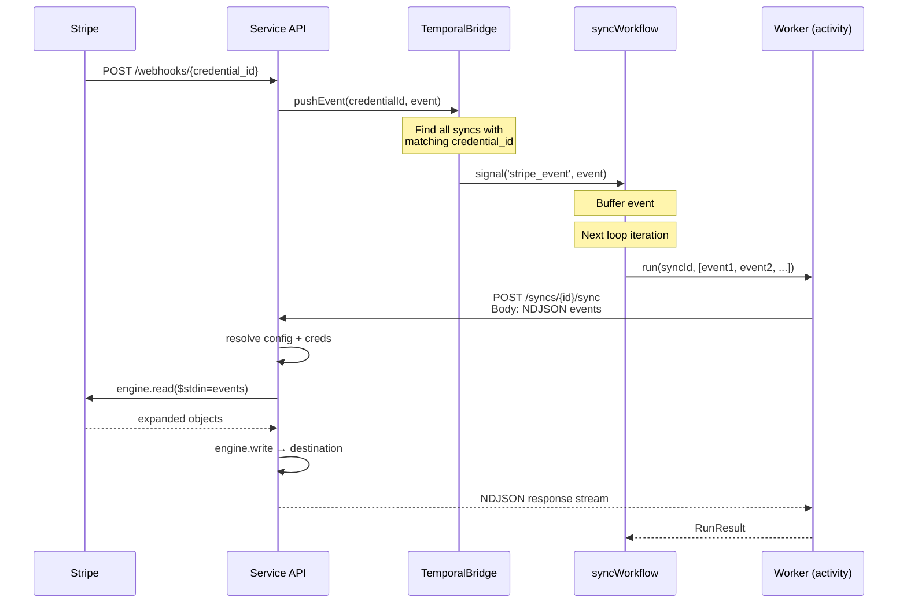
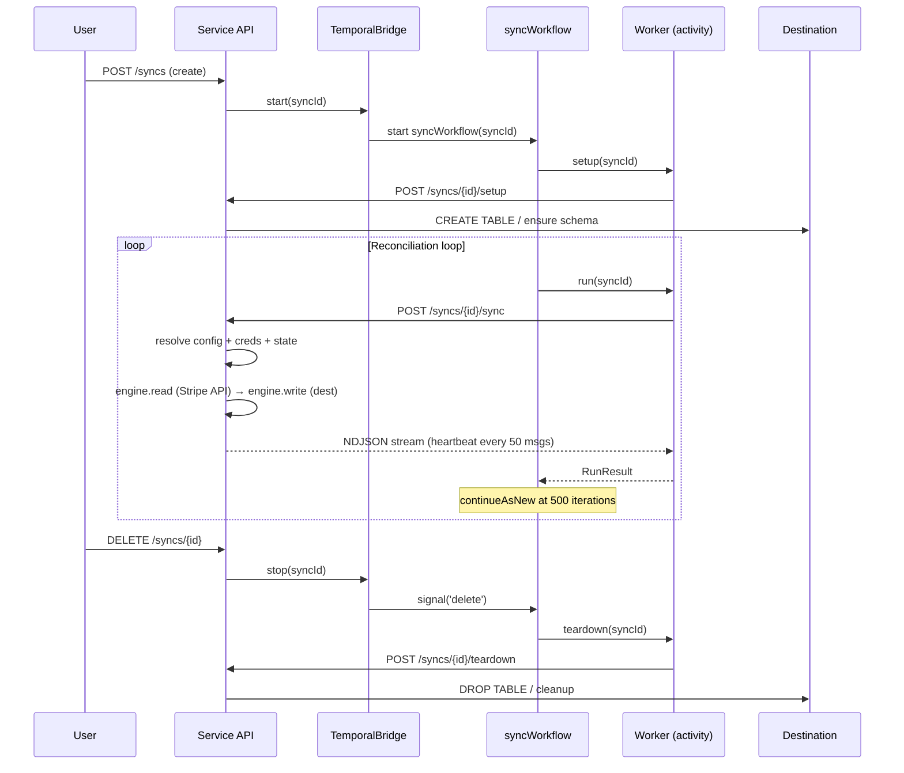
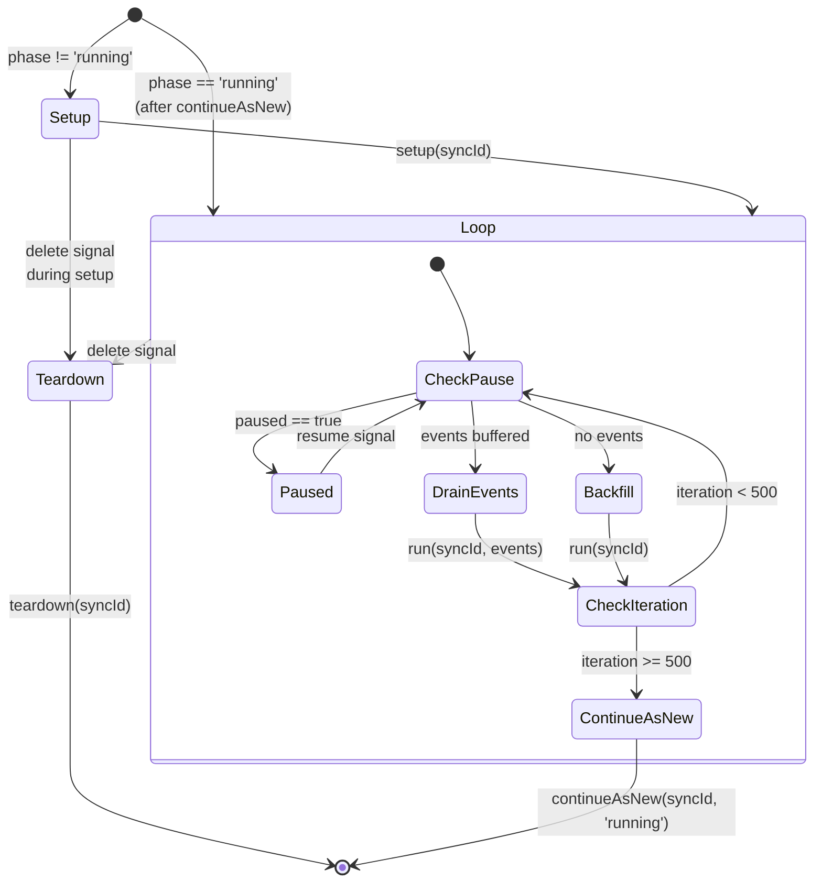

# Temporal Workflow Architecture

When Temporal is enabled, sync lifecycle is managed by durable workflows instead of running in-process. The workflow orchestrates setup, continuous reconciliation, live event processing, and teardown — all by calling the service HTTP API.

## Architecture Overview



## Webhook Event Flow

The webhook path is the most complex interaction — it crosses three boundaries (Stripe → Service → Temporal → Service):



## Backfill Flow

Backfill is simpler — no webhooks, just the workflow calling `run` in a loop:



## Workflow State Machine



## Key Design Decision: Activities Call the Service API

The old approach had activities calling the **stateless engine** API directly — passing the full `SyncConfig` + accumulated state on every call via an `X-Sync-Params` header. The new approach has activities call the **stateful service** API with just a `syncId`:

| Aspect                  | Before (engine API)              | After (service API)               |
| ----------------------- | -------------------------------- | --------------------------------- |
| Activity args           | Full `SyncConfig` + state        | Just `syncId`                     |
| State management        | Activities accumulate, pass back | Service persists automatically    |
| Credentials             | Inline in config every call      | Service resolves from store       |
| Workflow input          | `SyncConfig` object              | `syncId` string                   |
| `continueAsNew` payload | Full config + state              | `syncId` + phase                  |
| Config updates          | `updateConfigSignal` needed      | Service reads latest on each call |

## Components

### Workflow (`temporal/workflows.ts`)

**Input:** `syncWorkflow(syncId: string, opts?: { phase?: string })`

**Signals:**

- `stripe_event` — buffer a webhook event for processing
- `pause` / `resume` — pause/resume the sync loop
- `delete` — break the loop, run teardown, exit

**Query:**

- `status` → `{ phase, paused, iteration }`

### Activities (`temporal/activities.ts`)

Three activities, all HTTP calls to the service:

- **`setup(syncId)`** → `POST /syncs/{id}/setup` (expect 204)
- **`run(syncId, input?)`** → `POST /syncs/{id}/sync`
  - Without input: backfill mode (no body)
  - With events: sends NDJSON body
  - Streams response, heartbeats every 50 messages, collects errors
- **`teardown(syncId)`** → `POST /syncs/{id}/teardown` (expect 204)

Activity timeouts and retries:

| Activity | Start-to-close | Heartbeat | Max attempts |
| -------- | -------------- | --------- | ------------ |
| setup    | 2 min          | —         | 10           |
| run      | 10 min         | 2 min     | 10           |
| teardown | 2 min          | —         | 10           |

### Bridge (`temporal/bridge.ts`)

The `TemporalBridge` is the **client-side** adapter used by the service API to start/stop/signal workflows when CRUD operations happen:

| Service API route          | Bridge method                     | Temporal action                                           |
| -------------------------- | --------------------------------- | --------------------------------------------------------- |
| `POST /syncs`              | `bridge.start(syncId)`            | Start workflow                                            |
| `DELETE /syncs/{id}`       | `bridge.stop(syncId)`             | Signal `delete`                                           |
| `POST /syncs/{id}/pause`   | `bridge.pause(syncId)`            | Signal `pause`                                            |
| `POST /syncs/{id}/resume`  | `bridge.resume(syncId)`           | Signal `resume`                                           |
| `POST /webhooks/{cred_id}` | `bridge.pushEvent(credId, event)` | Signal `stripe_event` to all syncs sharing the credential |

### Worker (`temporal/worker.ts`)

Factory function that creates a Temporal `Worker` instance. Runs as a separate process via the CLI:

```sh
sync-service worker \
  --temporal-address localhost:7233 \
  --service-url http://localhost:4020
```

## Running Locally

```sh
# Terminal 1: Temporal dev server
temporal server start-dev

# Terminal 2: Sync service (with Temporal mode)
sync-service serve --temporal-address localhost:7233

# Terminal 3: Worker
sync-service worker --temporal-address localhost:7233
```

Create a sync — the workflow starts automatically:

```sh
# Create sync
curl -X POST http://localhost:4020/syncs \
  -H 'Content-Type: application/json' \
  -d '{
    "source": { "type": "stripe", "api_key": "sk_test_..." },
    "destination": { "type": "postgres", "connection_string": "postgresql://..." },
    "streams": [{ "name": "products" }]
  }'

# Check workflow status
temporal workflow query --workflow-id sync_<id> --type status

# Pause/resume
curl -X POST http://localhost:4020/syncs/<id>/pause
curl -X POST http://localhost:4020/syncs/<id>/resume

# Delete (triggers teardown)
curl -X DELETE http://localhost:4020/syncs/<id>
```

## Testing

### Unit tests (stubbed activities)

`apps/service/src/__tests__/temporal-workflow.test.ts` — uses `@temporalio/testing` with stubbed activities. Tests workflow logic in isolation:

- Setup → reconciliation → delete lifecycle
- Event processing via `stripe_event` signal
- Pause/resume
- Teardown on delete
- `continueAsNew` phase skip

### E2E tests (real Stripe + real destinations)

`e2e/temporal.test.ts` — full-stack tests using `@temporalio/testing` with real Stripe API and real destinations:

**Stripe → Postgres** (requires `STRIPE_API_KEY`):

1. Creates sync via service API
2. Backfills products from Stripe into Postgres
3. Updates a product via Stripe API, fetches the event, signals it to the workflow
4. Verifies the live update landed in Postgres
5. Signals delete, verifies teardown (schema dropped)

**Stripe → Google Sheets** (requires `STRIPE_API_KEY` + Google OAuth creds):

1. Creates sync via service API
2. Backfills products into a Google Sheet tab
3. Verifies row count and data shape
4. Cleans up the test tab

## Files

| File                                                   | Role                                            |
| ------------------------------------------------------ | ----------------------------------------------- |
| `apps/service/src/temporal/types.ts`                   | `RunResult`, `SyncActivities`, `WorkflowStatus` |
| `apps/service/src/temporal/activities.ts`              | HTTP activities calling service API             |
| `apps/service/src/temporal/workflows.ts`               | Workflow: signals, queries, main loop           |
| `apps/service/src/temporal/bridge.ts`                  | Client-side adapter (service → Temporal)        |
| `apps/service/src/temporal/worker.ts`                  | Worker factory                                  |
| `apps/service/src/cli/main.ts`                         | `worker` subcommand                             |
| `apps/service/src/__tests__/temporal-workflow.test.ts` | Unit tests                                      |
| `e2e/temporal.test.ts`                                 | E2E tests                                       |
