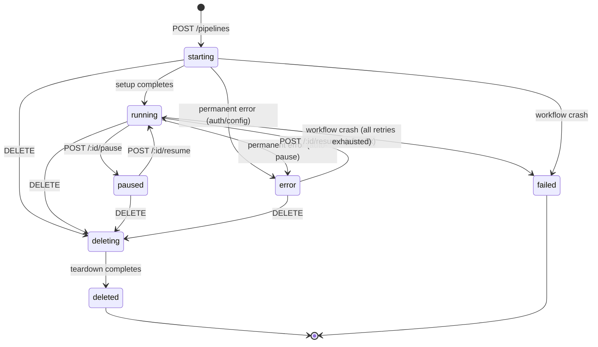
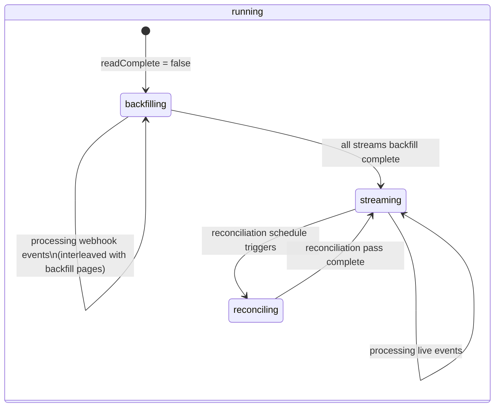

# Pipeline Status State Machine Design

> Save to `docs/plans/2026-04-03-pipeline-status-design.md`

## Context

Pipelines currently expose a minimal `{ phase: 'setup' | 'running', paused: boolean, iteration: number }` status that tells users almost nothing — no backfill progress, no error visibility, no distinction between "syncing live events" and "still loading historical data." Status transitions should fire webhooks and drive automation (auto-pause on permanent errors).

## Concerns the Status Model Must Address

1. **Is it running or stopped?** — The most basic question. Running, paused, dead.
2. **Who stopped it and why?** — User paused it? System auto-paused on error? Workflow crashed? User deleted it?
3. **Has initial backfill finished?** — "Is my historical data fully loaded yet?"
4. **Is it receiving live events?** — "Are webhooks flowing in?"
5. **Is it healthy?** — "Are errors happening?" Even if it's still running, transient errors might be accumulating.
6. **What went wrong?** — When errored: auth problem? Bad config? System bug? Which stream?
7. **Is it making progress?** — Iteration count, last successful sync timestamp. Detects "stuck" pipelines.
8. **When did it start?** — For SLA tracking and debugging.
9. **What's it doing right now?** — Backfilling page 500 of customers? Processing a webhook batch? Running a reconciliation pass? Idle waiting for events?
10. **Can I act on it?** — What actions are valid right now? Can I pause it? Resume it? Delete it?
11. **Should I be alerted?** — Status transitions that warrant notifications (error, backfill complete, recovered from error).
12. **Per-stream health** — Are all streams syncing, or is one stuck/errored while others are fine? (deferred)

## Design Decisions

- **API is source of truth**, UI renders it, status transitions trigger webhooks
- **Pipeline-level status** is primary, with `status_details` for per-stream granularity (deferred)
- **Binary error model** — healthy or errored, with details in error field
- **Auto-pause on permanent errors** (auth_error, config_error) — transient errors keep retrying
- **Backfill is a progress indicator** (`backfill_complete` boolean + `sub_status: 'backfilling'`), not a top-level phase — the pipeline is always "running" once started
- **Reconciling** included as a sub-state for v1
- **Error field** stores only the most recent error (no history array)

## State Machine

### User-Facing States



### Internal Sub-States (within "running")

The user sees `status: 'running'`. Internally, the workflow knows more:



Note: during `backfilling`, webhook events are still received and processed (interleaved with backfill pages, with webhooks taking priority).

### Example API Response

```jsonc
{
  "status": "running", // user-facing
  "sub_status": "backfilling", // internal, exposed for observability
  "backfill_complete": false,
  "error": null,
  "started_at": "2024-01-15T10:00:00Z",
  "last_synced_at": "2024-01-15T10:05:30Z",
  "iteration": 42,
}
```

### Transition Table

| From                 | To                 | Trigger                              | Webhook Event                | API Action         |
| -------------------- | ------------------ | ------------------------------------ | ---------------------------- | ------------------ |
| —                    | starting           | Pipeline created                     | `pipeline.created`           | `POST /pipelines`  |
| starting             | running            | Setup activity completes             | `pipeline.running`           | (automatic)        |
| starting             | error              | auth_error / config_error from setup | `pipeline.error`             | (automatic)        |
| running              | paused             | User pauses                          | `pipeline.paused`            | `POST /:id/pause`  |
| running              | error              | Permanent error detected             | `pipeline.error`             | (automatic)        |
| paused               | running            | User resumes                         | `pipeline.running`           | `POST /:id/resume` |
| error                | running            | User resumes after fixing            | `pipeline.running`           | `POST /:id/resume` |
| \*                   | deleting           | User deletes                         | `pipeline.deleting`          | `DELETE /:id`      |
| deleting             | deleted            | Teardown completes                   | `pipeline.deleted`           | (automatic)        |
| running              | failed             | Temporal workflow crash              | `pipeline.failed`            | (none — terminal)  |
| running(backfilling) | running(streaming) | All streams backfill done            | `pipeline.backfill_complete` | (automatic)        |

### Invalid Transitions (enforced)

- `deleted` → anything (terminal)
- `failed` → anything (terminal)
- `deleting` → `paused` (can't pause teardown)
- `deleting` → `error` (teardown errors are terminal → failed)
- `starting` → `paused` (can't pause before setup completes)
- `paused` → `error` (not running, so no errors to detect)

## Type Definitions

```typescript
// User-facing pipeline status (top-level)
type PipelineStatus =
  | 'starting' // setup activity running
  | 'running' // actively syncing
  | 'paused' // user-initiated pause
  | 'error' // auto-paused on permanent error
  | 'deleting' // teardown in progress
  | 'deleted' // terminal: cleaned up
  | 'failed' // terminal: workflow crashed

// Internal sub-status (within "running")
type PipelineSubStatus =
  | 'backfilling' // initial historical data load
  | 'streaming' // processing live events
  | 'reconciling' // periodic full-refresh pass
  | 'idle' // waiting for next event or schedule

// Error details
interface PipelineError {
  failure_type: 'config_error' | 'system_error' | 'transient_error' | 'auth_error'
  message: string
  stream?: string // which stream errored, if applicable
  occurred_at: string // ISO 8601
}

// Full status shape returned by API
interface PipelineStatusResponse {
  status: PipelineStatus
  sub_status?: PipelineSubStatus // only when status === 'running'
  backfill_complete: boolean
  error?: PipelineError // only when status === 'error'
  iteration: number
  started_at?: string // ISO 8601
  last_synced_at?: string // ISO 8601, last successful activity
}
```

## API Surface for User Control

| Endpoint                     | Allowed From States                      | Transitions To                           |
| ---------------------------- | ---------------------------------------- | ---------------------------------------- |
| `POST /pipelines`            | (none)                                   | `starting`                               |
| `POST /pipelines/:id/pause`  | `running`                                | `paused`                                 |
| `POST /pipelines/:id/resume` | `paused`, `error`                        | `running`                                |
| `DELETE /pipelines/:id`      | `starting`, `running`, `paused`, `error` | `deleting`                               |
| `PATCH /pipelines/:id`       | `running`, `paused`, `error`             | (same — config update, no status change) |

Resume from `error` clears the error and restarts the sync loop. If the underlying issue isn't fixed, the next activity will re-error and auto-pause again.

## Auto-Pause Rules

After each activity returns, inspect `result.errors`:

- `auth_error` or `config_error` → set `status = 'error'`, populate `error`, enter wait loop
- `transient_error` → log, continue (Temporal retry policy handles retries)
- `system_error` → log, continue (future: auto-pause after N consecutive)

## Webhook Events

Every status transition fires a webhook. Payload shape:

```typescript
interface PipelineWebhookEvent {
  event: string // e.g. 'pipeline.running', 'pipeline.error'
  pipeline_id: string
  status: PipelineStatus
  sub_status?: PipelineSubStatus
  previous_status: PipelineStatus
  error?: PipelineError // for pipeline.error events
  occurred_at: string // ISO 8601
}
```
