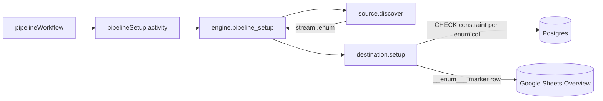

# JSON Schema enum enforcement in destinations

**Status:** Implemented
**Date:** 2026-04-26
**Canonical record:** [DDR-010](../architecture/decisions.md#ddr-010-json-schema-enum-enforcement-in-destinations)

## Problem

Sources stamp enum constraints onto stream JSON Schemas (e.g. `_account_id.enum: ["acct_123"]`). Nothing at the storage layer enforces these values, so a bug could let invalid data land in the destination.

## Design choice

Any column with an `enum` array in the JSON Schema gets a write-time constraint. The enum is stamped on the stream schema by the source, and destinations translate it into a native constraint. This is generic — not scoped to `_account_id` or any specific column.

Stamping the enum on the JSON Schema keeps the existing JSON-Schema → DDL pipeline as the sole writer of constraints, and `discoverCache` stays account-agnostic (stamping happens per call).

## Architecture

## Implementation map

- `packages/source-stripe/src/catalog.ts` — `catalogFromOpenApi` injects `_account_id: { type: 'string' }`; `stampAccountIdEnum` layers the per-pipeline enum via a fresh spread.
- `packages/source-stripe/src/index.ts` — `discover()` resolves the account, computes the allow-list, yields a stamped catalog. Cache stays account-neutral.
- `packages/destination-postgres/src/schemaProjection.ts` — `buildCreateTableWithSchema` iterates all enum properties and emits a `DO $check$` block per column; `enumCheckConstraintName` generates `chk_<table>_<col>`; `getExistingEnumAllowLists` parses `pg_get_constraintdef()` for the mismatch check.
- `packages/destination-postgres/src/index.ts` — `setup()` calls `assertEnumConstraintsConsistent` before any DDL.
- `packages/destination-google-sheets/src/writer.ts` — `ensureIntroSheet` writes per-column `__enum_<col>__` marker rows; `readEnumConstraints` reads them back.
- `packages/destination-google-sheets/src/index.ts` — `setup()` diffs the catalog enum against the Overview rows before writing; `write()` validates every record against the read-back set.

## Notes

- **Constraint validates existing rows.** If any row violates the enum, setup fails immediately — forcing the operator to clean up bad data before proceeding.
- **Rotation is operator-driven.** Mismatches throw with a guiding error rather than silently rewriting the constraint — see DDR-010.
