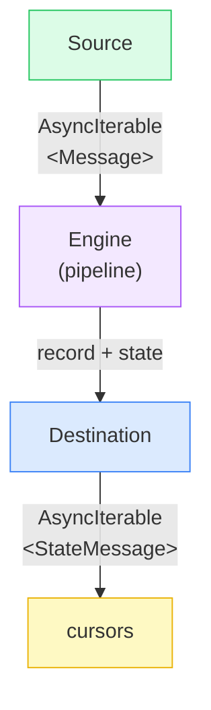
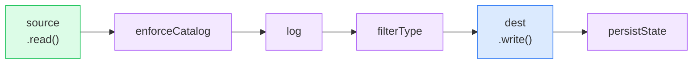
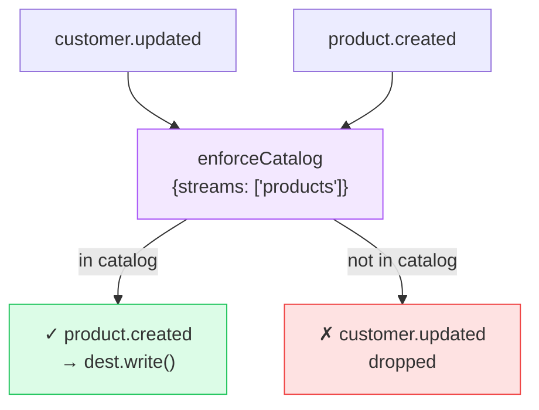
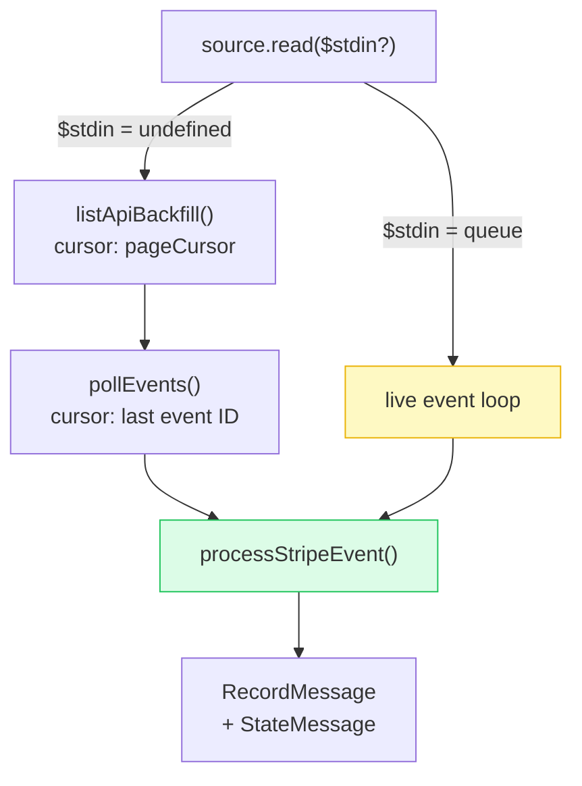
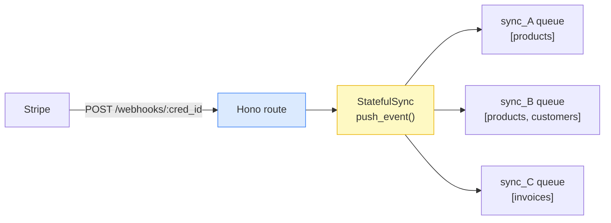
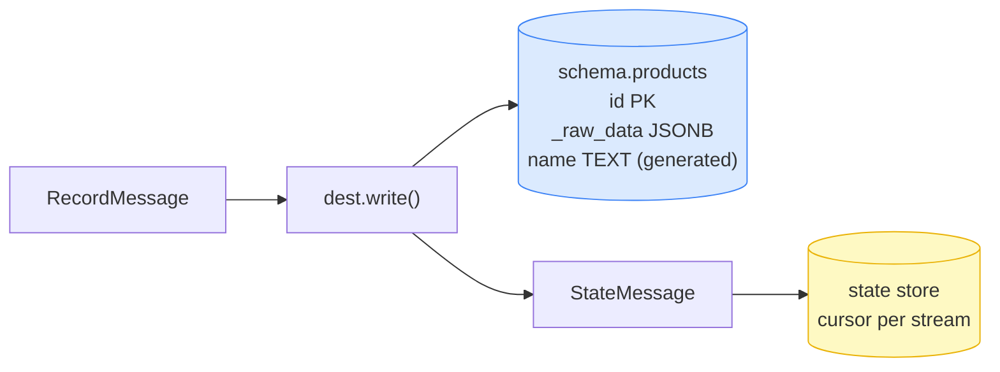
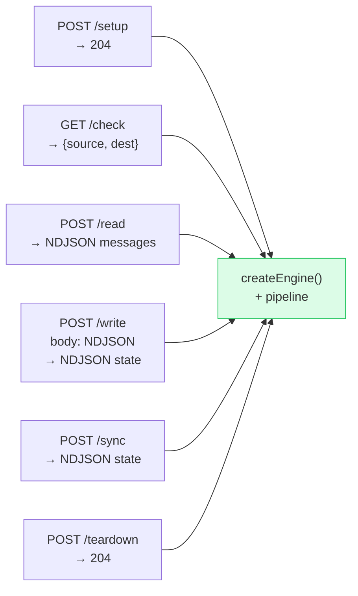

# Sync Engine Architecture

A transport-agnostic pipeline for syncing Stripe data to any destination

---

## The pipeline in one slide

```ts
pipe(
  source.read(params),             // AsyncIterable<Message>
  enforceCatalog(catalog),         // stream filter + field projection
  log,                             // diagnostics tap → stderr
  filterType('record', 'state'),   // narrow to what destinations need
  dest.write,                      // write records, emit state checkpoints
  persistState(store),             // save cursors after each checkpoint
)
```

Every component is `(AsyncIterable<A>) => AsyncIterable<B>`.
Stages compose left-to-right with `pipe()`.
Connectors only implement `source.read()` and `dest.write()` — nothing else.

---

## Three-layer stack

```
┌─────────────────────────────────────────────────┐
│  apps/service                                   │
│  StatefulSync · credential store                │  ← adds persistence + lifecycle
│  webhook fan-out · sync coordinator             │
├─────────────────────────────────────────────────┤
│  apps/engine                                    │
│  createEngine() · pipeline stages               │  ← wires the pipeline
│  HTTP API · NDJSON streaming · CLI              │
├─────────────────────────────────────────────────┤
│  packages/protocol                              │
│  Source<TConfig, TState, TInput>                │  ← what connectors implement
│  Destination<TConfig, TState>                   │
└─────────────────────────────────────────────────┘
```

Each layer only knows about the layer below it.
Connectors only know `protocol` — nothing about stores, queues, or HTTP.

---
layout: two-cols
---

## The connector contract

```ts
interface Source<TConfig, TState, TInput = never> {
  spec():     ConnectorSpecification
  check():    Promise<CheckResult>
  discover(): Promise<ConfiguredCatalog>
  setup():    Promise<void>
  read(params: SyncParams, $stdin?: AsyncIterable<TInput>):
              AsyncIterable<Message>
  teardown(opts?: { remove_shared_resources?: boolean }):
              Promise<void>
}

interface Destination<TConfig, TState> {
  spec():  ConnectorSpecification
  setup(): Promise<void>
  write(messages: AsyncIterable<RecordMessage | StateMessage>):
         AsyncIterable<StateMessage>
}
```

`Message` = `RecordMessage | StateMessage | LogMessage | ErrorMessage | StreamStatusMessage`

::right::

<br/><br/>



State flows **as messages in the stream**.
Connectors never touch a store directly.

---
layout: two-cols
---

## Pipeline stages

| Stage | Type | Role |
|-------|------|------|
| `source.read()` | Source | Emit NDJSON messages |
| `enforceCatalog()` | Filter | Drop streams/fields not in catalog |
| `log` | Tap | Print diagnostics, pass all messages through |
| `filterType()` | Filter | Narrow union to `record` + `state` |
| `dest.write` | Destination | Write records, emit state checkpoints |
| `persistState()` | Tap | Write cursors to store, pass all through |

::right::

<br/><br/>



`createEngine()` assembles this chain. All stages are independently testable.

---
layout: two-cols
---

## enforceCatalog — selective sync

`buildCatalog()` turns user-configured stream names and fields
into a `ConfiguredCatalog`. `enforceCatalog()` enforces it in the pipeline.

```ts
const catalog = buildCatalog(
  await source.discover(),      // all available streams
  params.streams,               // user selection
)
// catalog = { streams: [ { stream: { name: 'products' }, fields: [...] } ] }

enforceCatalog(catalog)(messages)
//  ↳ drops records for unlisted streams
//  ↳ trims record.data to allowed fields
//  ↳ passes log/error/stream_status unchanged
```

::right::

<br/>



---
layout: two-cols
---

## $stdin — one interface, two modes

```ts
// Backfill (one-shot): $stdin = undefined
const engine = createEngine(params, connectors, store)
for await (const s of engine.sync()) { }
//  1. listApiBackfill() — page through Stripe API
//  2. pollEvents()      — catch up on recent events
//  3. done ✓

// Live (forever): $stdin = webhook queue
const queue = new AsyncQueue<StripeEvent>()
for await (const s of engine.sync(queue)) { }
//  1. skips backfill
//  2. loops on queue forever → processStripeEvent()
```

`$stdin` is the seam between one-shot and live modes.
The same `Source` handles both without any protocol change.

::right::

<br/>



---
layout: two-cols
---

## Webhook fan-out

Stripe caps accounts at ~16 webhook endpoints.
One endpoint serves all syncs under a credential.

```ts
// StatefulSync.push_event(credentialId, event)
//  → finds all syncs under this credential
//  → pushes to each sync's AsyncQueue

// Each sync's source.read() has its own $stdin
// The fan-out is invisible to the connector
```

::right::

<br/><br/>



Filtering happens **inside each source** against its own catalog.
`sync_A` ignores the `customer.updated` event; `sync_B` processes it.

---
layout: two-cols
---

## Destination: Postgres

```
Record {
  stream: "products"
  data: { id: "prod_1", name: "Widget", ... }
}
  ↓
UPSERT INTO <schema>.products (id, _raw_data, ...)
  ON CONFLICT (id) DO UPDATE SET ...
```

- **Schema per sync** — complete isolation between syncs
- **`_raw_data` column** — full Stripe object as JSONB
- **Generated columns** — typed fields derived from `_raw_data`
- **Tables created on first write** — no migration step

::right::

<br/><br/>



---

## HTTP API

All routes accept `X-Sync-Params` (JSON-encoded `SyncParams`) and stream NDJSON responses.

<Transform :scale="0.9">



</Transform>

`read` + `write` separately → composable. `sync` = `write(read())` in one call.

---

## Key design decisions

**`$stdin` as the seam**
`undefined` → one-shot backfill + event poll → done.
`AsyncIterable` → live event loop, runs forever.
Same `Source` interface. No protocol changes needed for live mode.

**Stateless / stateful split**
Engine = one-shot, caller provides everything, no memory between calls.
Service = persistent credentials, cursors, lifecycle management, fan-out.

**Transport-agnostic pipeline**
The pipeline is async iterables end-to-end. The transport is whatever drives them:
- **stdio** — CLI mode, source stdout piped to dest stdin, great for scripts and local dev
- **HTTP streaming** — server mode, same `createEngine()` behind a Hono route, response body streams NDJSON
- **Temporal activity** — worker calls the HTTP server; retry/scheduling provided by Temporal

**Connector isolation**
Connectors implement `protocol` only. No stores, queues, HTTP, or cloud.
Swap the transport; keep the connector.

**`remove_shared_resources` on teardown**
Service checks whether other syncs share the credential before deleting
the Stripe webhook endpoint — prevents one sync from breaking its siblings.
