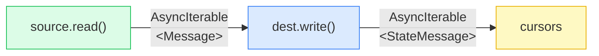
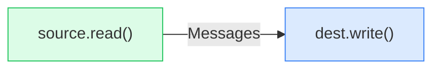
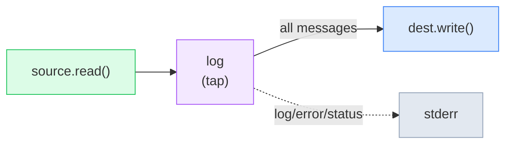
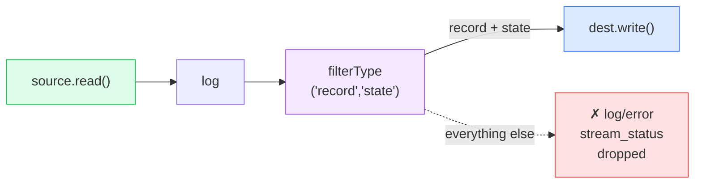
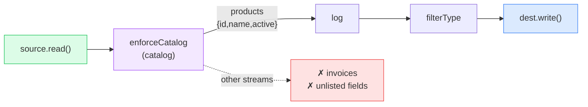
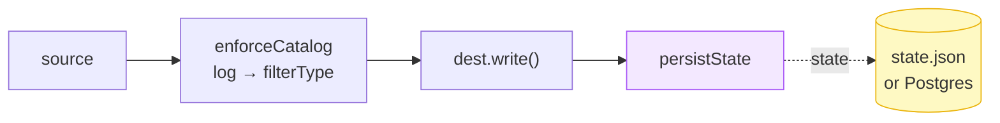
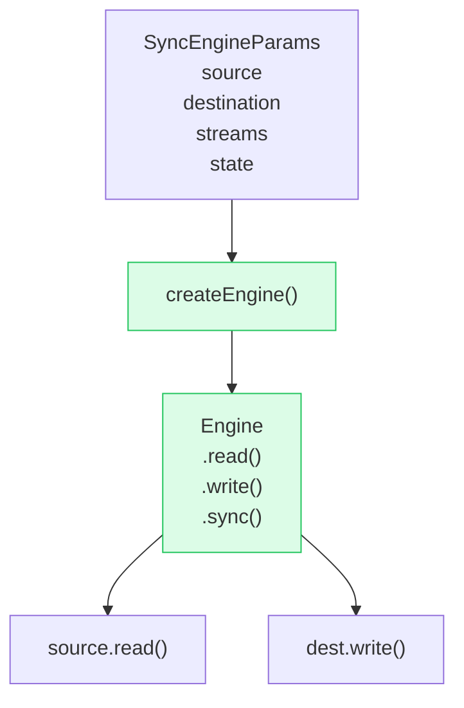
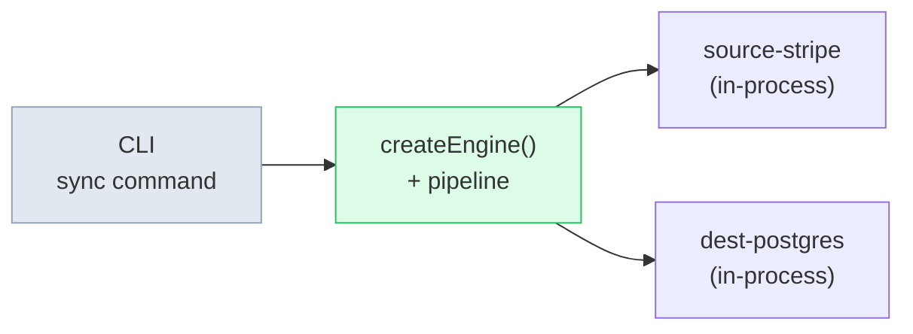
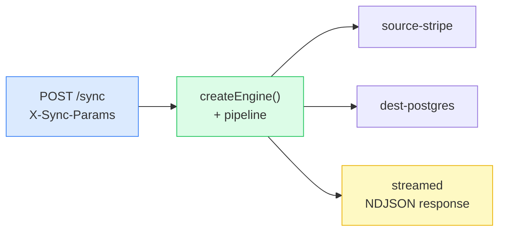
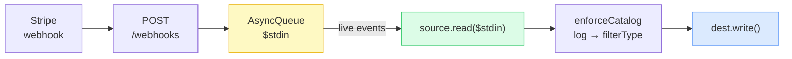

# Source → Destination

Building the sync pipeline, one step at a time

---

## The Protocol: NDJSON on the wire

No SDK. No framework. Just newline-delimited JSON.

```ts
type Message =
  | { type: 'record'; stream: string; data: Record<string, unknown>; emitted_at: string }
  | { type: 'state'; stream: string; data: unknown } // cursor checkpoint
  | { type: 'log'; level: string; message: string } // diagnostic
  | { type: 'error'; failure_type: string; message: string }
  | { type: 'stream_status'; stream: string; status: string } // progress signal
```

A source produces this stream. A destination consumes it. The simplest transport is stdio.

```bash
{"type":"record","stream":"products","data":{"id":"prod_1","name":"Widget"},"emitted_at":"2024-01-01T00:00:00.000Z"}
{"type":"state","stream":"products","data":{"cursor":"evt_123"}}
{"type":"log","level":"info","message":"Fetched page 1"}
```

---

## layout: two-cols

## Step 1 — source.read() → dest.write()

The minimal valid pipeline.

```ts
const messages: AsyncIterable<Message> = source.read(params)

const states: AsyncIterable<StateMessage> = dest.write(messages)

// Drain the pipeline
for await (const state of states) {
  //  { type: 'state', stream: 'products', data: { cursor: 'evt_123' } }
}
```

Connectors are async generators — no framework, no magic.

::right::

<br/><br/>



---

## layout: two-cols

## Step 2 — pipe() for explicit composition

`pipe()` is a left-fold over transformation functions.

```ts
const output = pipe(
  source.read(params),
  dest.write,
)

for await (const state of output) { … }
```

```ts
// Implementation
function pipe(src, ...fns) {
  return fns.reduce((acc, fn) => fn(acc), src)
}
```

Equivalent to Step 1 — but now we can insert stages between the arrows.

::right::

<br/><br/>



Each stage is `(AsyncIterable<A>) => AsyncIterable<B>`. Compose as many as you need.

---

## layout: two-cols

## Step 3 — log (tap)

Sources emit `log`, `error`, and `stream_status` messages alongside data.
`log` prints them to stderr and passes everything through unchanged.

```ts {3}
const output = pipe(
  source.read(params),
  log, // ← new
  dest.write
)
```

```ts
export async function* log(messages) {
  for await (const msg of messages) {
    if (msg.type === 'log') console.error(`[${msg.level}] ${msg.message}`)
    else if (msg.type === 'error') console.error(`[error:${msg.failure_type}] ${msg.message}`)
    else if (msg.type === 'stream_status') console.error(`[status] ${msg.stream}: ${msg.status}`)
    yield msg // pass everything through
  }
}
```

::right::

<br/>



Taps are transparent: every message still reaches the destination.

---

## layout: two-cols

## Step 4 — filterType (guard the destination)

Destinations only want `record` and `state`.
`filterType` narrows the union, dropping everything else.

```ts {4}
const output = pipe(
  source.read(params),
  log,
  filterType('record', 'state'), // ← new
  dest.write
)
```

```ts
export function filterType(...types) {
  const set = new Set(types)
  return async function* (messages) {
    for await (const msg of messages) {
      if (set.has(msg.type)) yield msg
    }
  }
}
```

::right::

<br/>



---

## layout: two-cols

## Step 5 — enforceCatalog (selective sync)

The source emits records for all its streams.
`enforceCatalog` keeps only the streams and fields you ask for.

```ts {1-6,10}
const catalog = {
  streams: [
    { stream: { name: 'products' }, fields: ['id', 'name', 'active'] },
    //  ↑ invoices not listed → all invoice records dropped
  ],
}

const output = pipe(
  source.read(params),
  enforceCatalog(catalog), // ← new
  log,
  filterType('record', 'state'),
  dest.write
)
```

::right::

<br/>



Two jobs: **stream filtering** (drop unknown streams) and **field projection** (trim records to allowed columns).

---

## layout: two-cols

## Step 6 — persistState (checkpoint)

`persistState` intercepts outgoing state messages, writes cursors to a store, and passes everything through.

```ts {6}
const output = pipe(
  source.read(params),
  enforceCatalog(catalog),
  log,
  filterType('record', 'state'),
  dest.write,
  persistState(store) // ← new
)

for await (const _ of output) {
} // drive the pipeline
```

```ts
export function persistState(store) {
  return async function* (messages) {
    for await (const msg of messages) {
      if (msg.type === 'state') await store.set(msg.stream, msg.data)
      yield msg
    }
  }
}
```

::right::

<br/>



The next run loads `state.json` and passes cursors into `source.read(params)` — incremental sync.

---

## The complete pipeline

Six stages, assembled in order.

```ts
pipe(
  source.read(params), // 0. emit NDJSON messages
  enforceCatalog(catalog), // 1. drop unwanted streams and fields
  log, // 2. print diagnostics to stderr
  filterType('record', 'state'), // 3. guard the destination's input type
  dest.write, // 4. write records, emit state checkpoints
  persistState(store) // 5. save cursors after each checkpoint
)
```

Each stage is a function `(AsyncIterable<A>) => AsyncIterable<B>`.
Swap any stage. Add new stages. The others don't change.

---

## layout: two-cols

## createEngine() — the assembled machine

`createEngine()` runs the pipeline above,
plus catalog discovery, config validation, and state loading.

```ts
const engine = createEngine(
  {
    source:      { name: 'stripe', api_key: 'sk_test_...' },
    destination: { name: 'postgres', connection_string: 'postgres://...' },
    streams: [
      { name: 'products', fields: ['id', 'name', 'active'] },
    ],
    state: await store.getAll(),  // resume from last run
  },
  { source, destination },
  store,
)

// engine.sync() = read → enforceCatalog → log → filterType → write → persistState
for await (const state of engine.sync()) { … }
```

::right::

<br/>



## Step 8 — Any transport, same pipeline

The pipeline is just async iterables. The transport is whatever drives them.

```
┌──────────────────────────────────────────────────────────────────┐
│  Transport: stdio                 Transport: HTTP streaming       │
│                                                                   │
│  source-stripe | dest-postgres    POST /sync                      │
│                                   X-Sync-Params: {...}            │
│  ↓ stdout NDJSON                  ↓ response body NDJSON          │
│  ↑ stdin  NDJSON                  ↑ request body NDJSON           │
│                                                                   │
│  same createEngine()              same createEngine()             │
│  same pipeline stages             same pipeline stages            │
└──────────────────────────────────────────────────────────────────┘
```

---

## layout: two-cols

## Step 8 — stdio transport (CLI / demo)

```bash
# Run directly — source stdout piped to dest stdin
node dist/bin/sync-engine.js sync \
  --source stripe \
  --source-config '{"api_key":"sk_test_...","backfill_limit":50}' \
  --destination postgres \
  --destination-config '{"connection_string":"postgres://..."}' \
  --streams '[{"name":"products"}]'
```

Source and destination run **in-process**.
stdin/stdout carry the NDJSON stream.
Great for one-shot scripts, local dev, and piping to other tools.

::right::

<br/>



---

## layout: two-cols

## Step 8 — HTTP streaming transport (server)

```bash
# Start the engine server
PORT=3000 node dist/bin/serve.js

# Run a sync over HTTP — response streams NDJSON
curl -X POST http://localhost:3000/sync \
  -H 'X-Sync-Params: {
    "source": { "name": "stripe", "api_key": "sk_test_...", "backfill_limit": 50 },
    "destination": { "name": "postgres", "connection_string": "postgres://..." },
    "streams": [{ "name": "products" }]
  }'
```

Same `createEngine()`. Response body **streams** NDJSON state checkpoints as they're produced.

::right::

<br/>



The **transport changed**. The pipeline didn't.

---

## layout: two-cols

## $stdin — live event loop

Pass an `AsyncIterable` as `$stdin` to switch from one-shot backfill to a live event loop.

```ts
// Backfill (one-shot) — $stdin = undefined
for await (const s of engine.sync()) { … }
// terminates when backfill + event poll completes

// Live (forever) — $stdin = webhook queue
const queue = new AsyncQueue<StripeEvent>()

app.post('/webhooks/:credential_id', (req) => {
  queue.push(req.body)   // fan-out from one endpoint to N syncs
})

for await (const s of engine.sync(queue)) { … }
// never terminates — processes events as they arrive
```

::right::

<br/>



Same `Source` interface. No protocol change needed.

---

## Summary

| Step | Addition                       | What it does                              |
| ---- | ------------------------------ | ----------------------------------------- |
| 1    | `source.read() → dest.write()` | Minimal pipe                              |
| 2    | `pipe()`                       | Explicit composition                      |
| 3    | `log`                          | Diagnostics to stderr                     |
| 4    | `filterType('record','state')` | Guard the destination                     |
| 5    | `enforceCatalog(catalog)`      | Stream filter + field projection          |
| 6    | `persistState(store)`          | Checkpoint cursors after each batch       |
| 7    | `createEngine()`               | Assemble + catalog discovery + validation |
| 8a   | stdio (CLI)                    | One-shot, in-process, pipe-friendly       |
| 8b   | HTTP streaming (server)        | Remote, multi-tenant, Temporal-ready      |
| 9    | `engine.sync($stdin)`          | Live event loop from webhook queue        |
