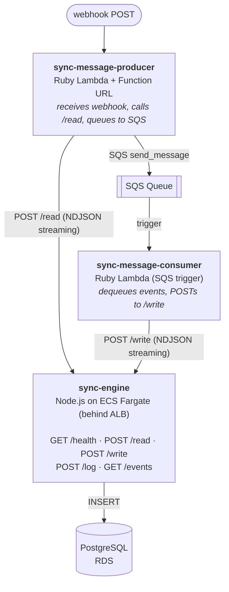
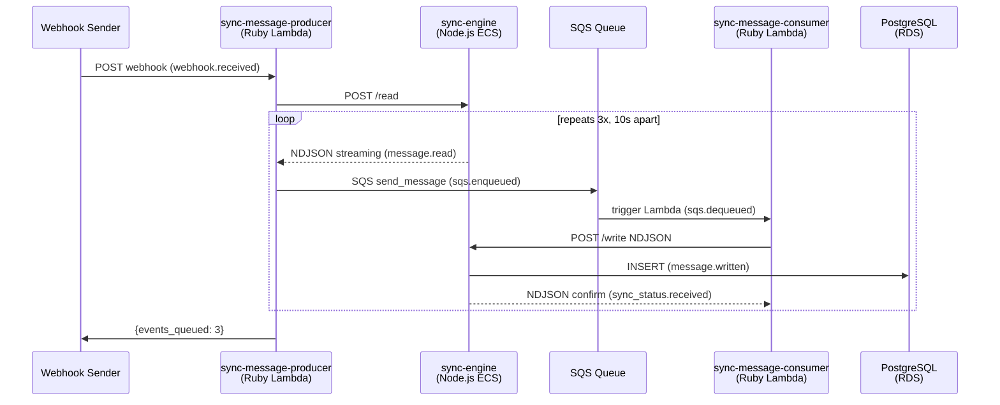

# sync-engine-infra-sandbox

End-to-end streaming pipeline: webhook ingestion through to PostgreSQL, with full lifecycle observability.

## Architecture



Node.js is the **only** component that talks to PostgreSQL. Ruby handles SQS and HTTP transport.

## Sequence diagram



## Event lifecycle

Each event passes through 6 observable stages, logged to the `event_log` table:

| Stage | Where | Description |
|---|---|---|
| `webhook.received` | Ruby producer → `/log` | Webhook payload arrived |
| `message.read` | Node.js `/read` | Event generated and streamed to caller |
| `sqs.enqueued` | Ruby producer → `/log` | Event sent to SQS |
| `sqs.dequeued` | Ruby consumer → `/log` | Consumer picked up event from SQS |
| `message.written` | Node.js `/write` | Event inserted into PostgreSQL |
| `sync_status.received` | Ruby consumer → `/log` | Consumer received write confirmation |

With 3 events per webhook (10s apart), the e2e test proves streaming — each event's full lifecycle completes in ~150ms before the next event is emitted:

```
  +   0.00s            test_xxx  webhook.received
  +   0.02s      evt_test_xxx_0  message.read
  +   0.08s      evt_test_xxx_0  sqs.enqueued
  +   0.13s      evt_test_xxx_0  sqs.dequeued
  +   0.15s      evt_test_xxx_0  message.written
  +   0.16s      evt_test_xxx_0  sync_status.received
  +  10.02s      evt_test_xxx_1  message.read
  ...
  +  20.13s      evt_test_xxx_2  sync_status.received
```

## Infrastructure

All managed by Terraform (`main.tf`):

- **RDS PostgreSQL** — `db.t4g.micro`, public, PostgreSQL 16
- **SQS queue** — `sync-engine-events`, 120s visibility timeout
- **ECR** — Docker image registry for sync-engine
- **ECS Fargate** — 256 CPU / 512 MiB, single task, public subnet
- **ALB** — Internet-facing, 120s idle timeout (important for streaming)
- **Lambda: sync-message-producer** — Ruby 3.3, arm64, Function URL (no auth)
- **Lambda: sync-message-consumer** — Ruby 3.3, arm64, SQS event source (batch size 10)

## Project structure

```
├── main.tf                          # Terraform: all AWS resources
├── variables.tf                     # Terraform: region, db credentials
├── outputs.tf                       # Terraform: URLs, connection strings
├── build.sh                         # Build Lambda zips + Docker image, push to ECR
├── test_e2e.sh                      # End-to-end streaming pipeline test
├── lambda/
│   ├── producer/
│   │   └── lambda_function.rb       # Receives webhooks, calls /read, queues to SQS
│   ├── sync-engine/
│   │   ├── server.mjs               # Node.js HTTP server (ECS Fargate)
│   │   ├── package.json             # Dependencies (pg)
│   │   └── Dockerfile               # node:20-slim container
│   └── consumer/
│       ├── lambda_function.rb       # SQS consumer, POSTs to /write via sync-engine
│       └── Gemfile                  # No external gems (stdlib only)
```

## Deploy

Requires: AWS CLI configured, Terraform, Docker.

```bash
# First time: create ECR repo, then build + push image, then deploy everything
terraform apply -target=aws_ecr_repository.sync_engine
./build.sh
terraform apply

# Subsequent deploys: rebuild + push, then roll ECS
./build.sh
aws ecs update-service --cluster sync-engine --service sync-engine --force-new-deployment --region us-west-2
```

## Test

```bash
./test_e2e.sh
```

Sends a webhook, polls the event log, and prints each stage as it arrives. Passes when all 16 stages (1 webhook + 5 per event x 3 events) are logged sequentially.
